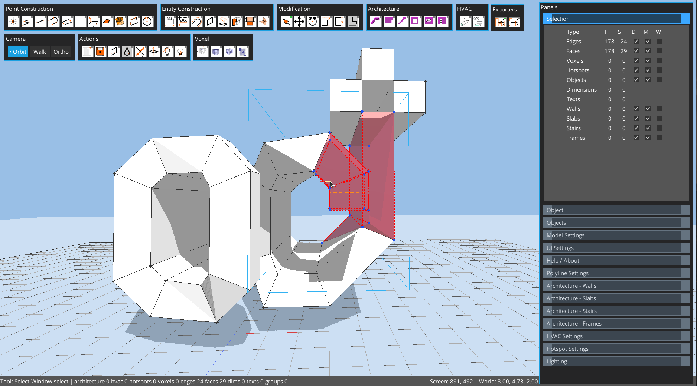
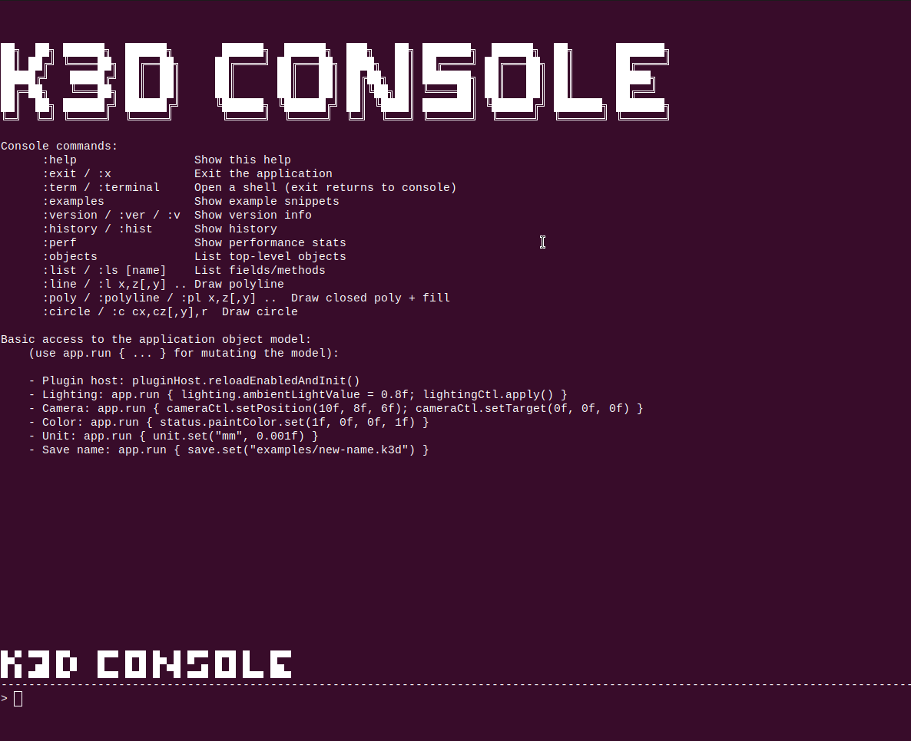

#  Octodraw


Octodraw is a Kotlin + libGDX desktop modeler for fast, direct 3D sketching. It focuses on edges, planar faces, and tool-driven workflows with precise snapping, groups (objects), and a live Groovy console for power users.

Android builds are available, but the Android experience is currently optimized for external mouse + keyboard (touch-only use is limited).




## Highlights

- Direct modeling: draw edges, create faces, and push/pull solids.
- Precision: snapping to grid, endpoints, midpoints, lines, faces, and guides.
- Object workflow: group geometry into reusable object prototypes and instances.
- Hotspot-driven visual programming for dynamic per-instance geometry behaviors.
- Measurements: linear dimensions, numeric input, and unit-aware modeling.
- Custom lighting and shadows with real-time controls.
- Groovy-powered dev console and plugin system.


## Core tools

- Select, Line, Rectangle, Surface Rectangle, Quad, Circle
- Push/Pull, Move, Rotate, Scale, Stretch
- Linear Dimension, Text, Paint, Object placement
- Eraser tool (placeholder in this build)

## Selection and snapping

- Click, window (left-to-right), crossing (right-to-left), and volume selection.
- Double-click groups to enter edit mode; double-click faces for coplanar selection; triple-click for connected geometry.
- Snap to grid intersections/lines, endpoints, midpoints, line segments, faces, and guides.
- Guides: `G` for grid guides, `T` for axis guides (Esc clears guides in Select mode).
- Undo/redo: `Ctrl+Z` / `Ctrl+Y` (or `Ctrl+Shift+Z`).

## Objects (groups and prototypes)

- Create object prototypes from selection (`Ctrl+G` or `Ctrl+O`).
- Place instances via the Objects panel or Object tool.
- Edit an object by double-clicking an instance.
- Glue-to-surface option keeps objects aligned to a picked surface during moves.

## Panels and UI

- Selection, Object Info, Objects, Model Settings, Lighting, Plugin Manager.
- Action buttons: Cleanup, Delete, Flip Faces, Color, Lighting, Plugin Manager.
- Command Palette (`Ctrl+Shift+P`) for tools and panel actions.

## Built-in console (dev)

The dev console is a persistent Groovy REPL that runs alongside the GUI. Start it via the desktop launcher command:

```
edit --file path/to/model.octd
```

Inside the console, type `:help` and `:examples` for meta commands and snippets. Use `app.run { ... }` to mutate the model safely.
Use `:perf` to print memory, disk, thread, and CPU stats.

## Files and autosave

- Default file: `octodraw.octd` in the working directory.
- Autosaves on geometry, selection, and settings changes.
- Model files store camera, lighting, shadow settings, units, and grid spacing.

## Downloads and running

Grab the latest release from GitHub Releases and run the platform launcher:

- Windows: `octodraw-jre.cmd` (bundled runtime) or `octodraw.cmd` (system Java)
- macOS / Linux: `./octodraw-jre` (bundled runtime) or `./octodraw-editor` (system Java)

## CLI commands (desktop launcher)

```
edit --file <path> [--size WIDTHxHEIGHT]   Open or create a model file
edit --plugins-dir <path>                 Override plugins folder
groovy <script>                           Run a Groovy script file
version                                  Show version information
update                                   Download and replace the editor jar
help                                     Show help
```

## Build from source

```
./gradlew build
./gradlew :lwjgl3:run
```

## Documentation

- User manual: [`docs/USER_MANUAL.md`](docs/USER_MANUAL.md)
- Shortcuts: [`SHORTCUTS.md`](SHORTCUTS.md)
- Plugin development: [`docs/PLUGIN_DEVELOPMENT.md`](docs/PLUGIN_DEVELOPMENT.md)
- Android store description text (Play/F-Droid): [`docs/specification/ANDROID_STORE_DESCRIPTION.md`](docs/specification/ANDROID_STORE_DESCRIPTION.md)
- Specs: [`docs/specification/`](docs/specification/)
- Detailed roadmap: [`docs/specification/ROADMAP.md`](docs/specification/ROADMAP.md)

## Release notes

- 3.1.0: [`docs/specification/RELEASE_NOTES-3.1.0.md`](docs/specification/RELEASE_NOTES-3.1.0.md)
- 2.9.0: [`docs/specification/RELEASE_NOTES-2.9.0.md`](docs/specification/RELEASE_NOTES-2.9.0.md)
- 2.7.5: [`docs/specification/RELEASE_NOTES-2.7.5.md`](docs/specification/RELEASE_NOTES-2.7.5.md)
- 1.7.10: [`docs/specification/RELEASE_NOTES-1.7.10.md`](docs/specification/RELEASE_NOTES-1.7.10.md)
- 1.7.9: [`docs/specification/RELEASE_NOTES-1.7.9.md`](docs/specification/RELEASE_NOTES-1.7.9.md)
- 1.7.8: [`docs/specification/RELEASE_NOTES-1.7.8.md`](docs/specification/RELEASE_NOTES-1.7.8.md)
- 1.7.3: [`docs/specification/RELEASE_NOTES-1.7.3.md`](docs/specification/RELEASE_NOTES-1.7.3.md)
- 1.7.1: [`docs/specification/RELEASE_NOTES-1.7.1.md`](docs/specification/RELEASE_NOTES-1.7.1.md)
- 1.4.3: [`docs/specification/RELEASE_NOTES-1.4.3.md`](docs/specification/RELEASE_NOTES-1.4.3.md)

## Roadmap (current priorities)

1. M1 - UI foundation
   - Split built-in tools into Construction and Modification groups (Actions remain separate).
   - Always show tool button labels.
   - Add delayed hover popovers near controls.
   - Use floating, movable toolbars with persisted layout.

2. M2 - OpenSCAD integration (before domain plugins)
   - Introduce a parametric generation pipeline (`inputs -> generated faces/lines`).
   - Add regeneration cache and invalidation.
   - Add safe execution boundaries (timeouts/errors surfaced in UI).
   - Support explode of generated objects into static geometry.

3. M3 - Solid tools on the same backend
   - Add boolean operations (union / intersection / difference).

4. M4 - Domain plugins on top of the core
   - Voxel plugin (voxel, volume, frame).
   - Architecture plugin (wall, slab, stair, rectangular hole workflow).
   - Mechanical plugin (gear first, then additional parametric parts).

5. M5 - Consolidation
   - Unify plugin object lifecycle (edit/open/close/explode/update).
   - Keep robust fallback behavior when OpenSCAD runtime is missing or fails.

## Status

Octodraw is an active work-in-progress. File formats and APIs may evolve as new modeling and topology features land.
