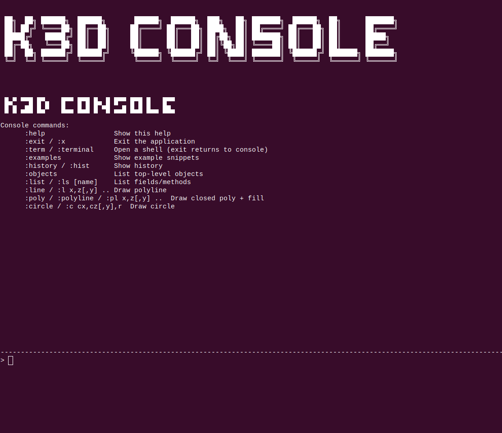
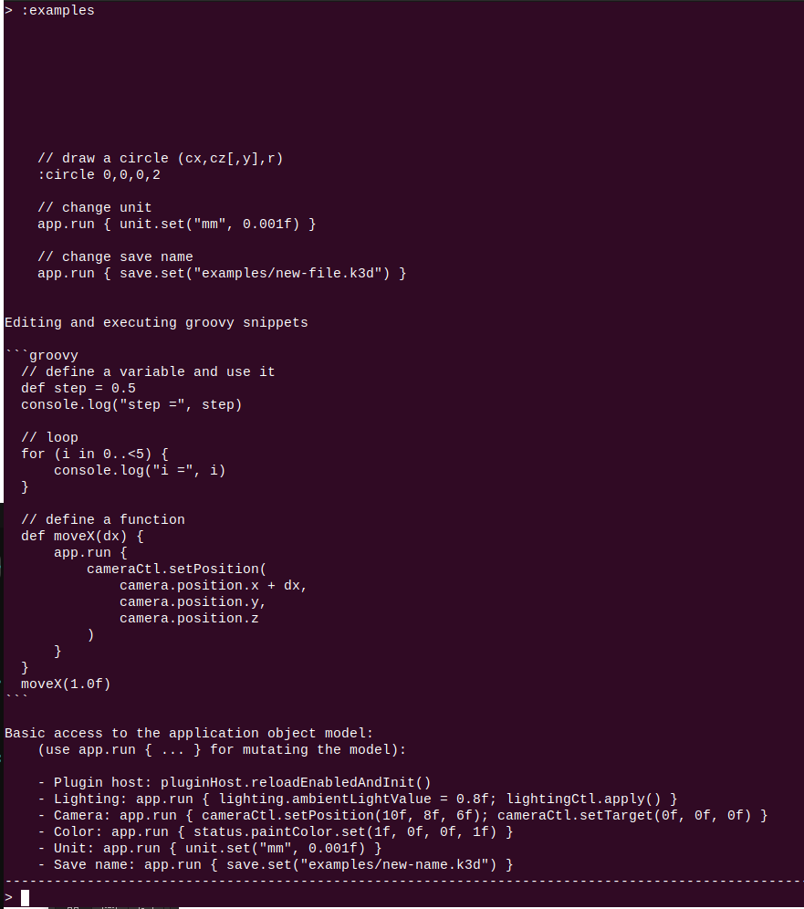
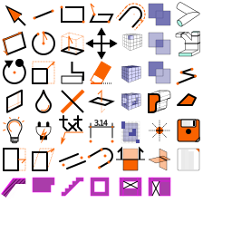
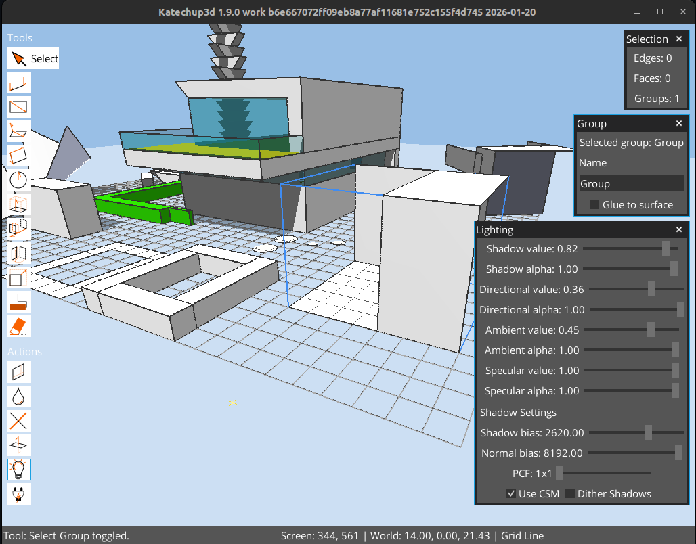
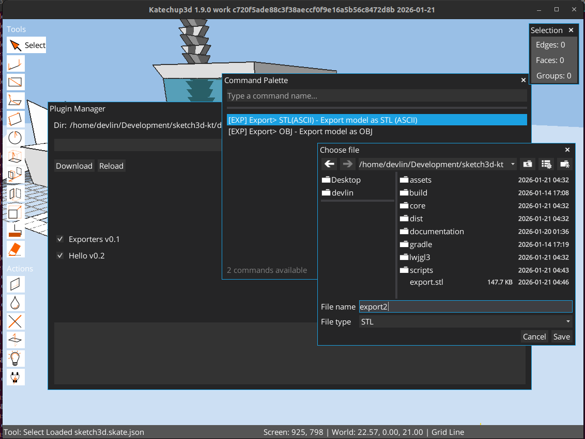
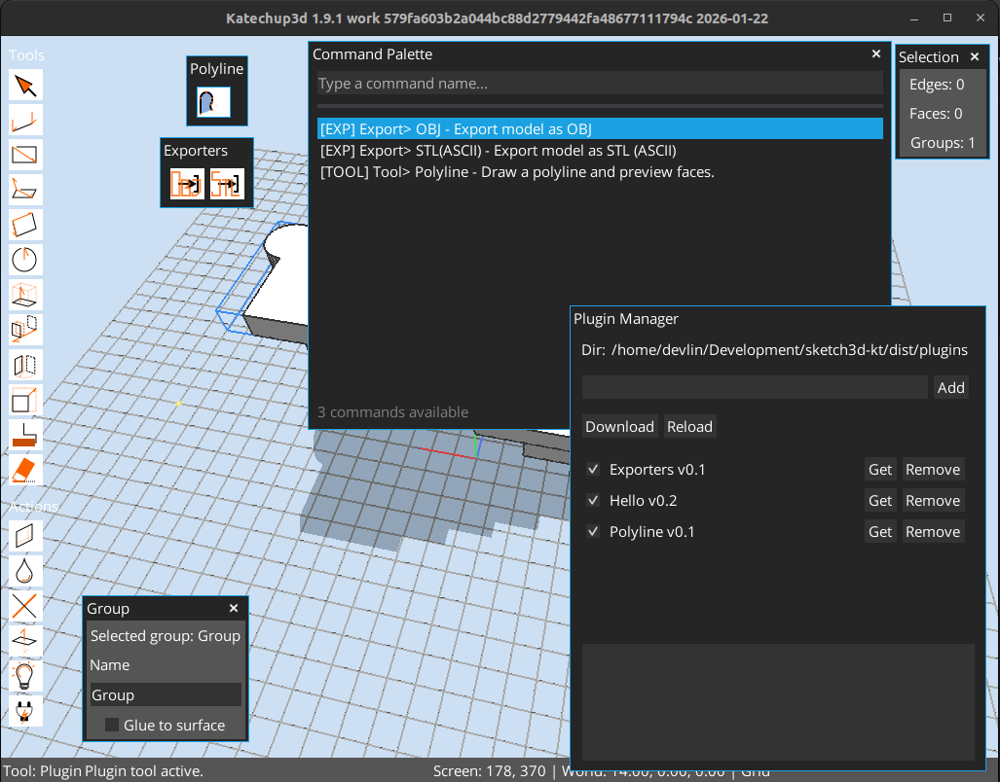
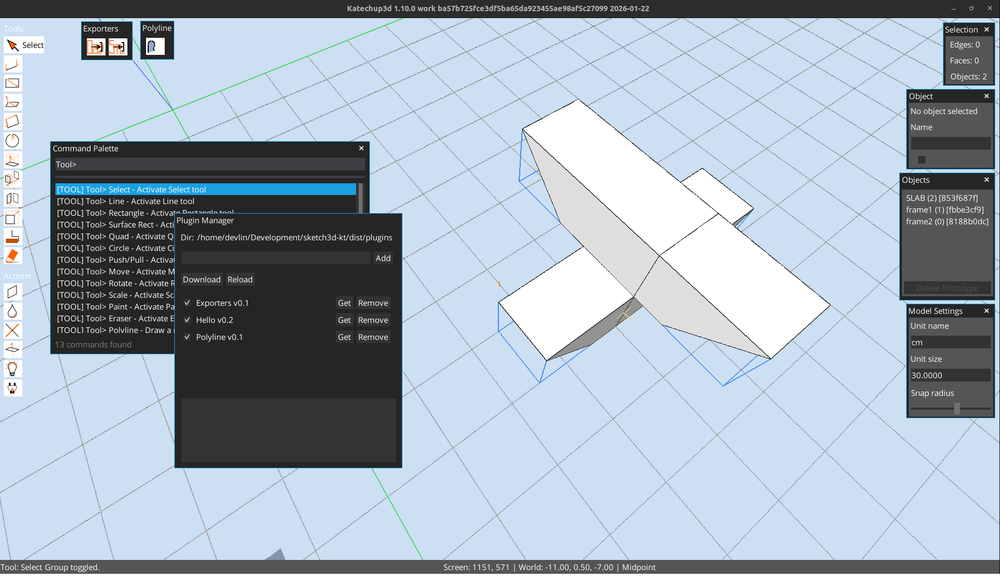

# K3D

GUI

console

K3D is a Kotlin + libGDX (jvm) desktop application for interactively creating and editing simple 3D geometry. It focuses on direct modeling with edges and planar faces, real-time snapping, and tool-driven workflows.

## What it does today

- Renders a 3D viewport with grid, axes, and guides.
- Supports camera orbit and pan controls.
- Provides core drawing tools for lines, rectangles, and circles.
- Creates faces from closed polylines and from rectangle/circle tools.
- Includes snapping to endpoints, midpoints, grid points/lines, and guides.
- Offers push/pull extrusion on planar faces.
- Provides a cleanup action to split intersections and re-weld edges.

## What it is intended to do

- Expand modeling tools (move/rotate/scale, selection, painting, erasing).
- Build a robust topology layer for edges/faces with adjacency.
- Support face splitting and more reliable boolean-like operations.
- Improve performance through spatial indices for picking and snapping.
- Add project persistence (save/load) and export formats.

### Built-in console

after launching the application ( the jar basically ).
the console exposes a chromium like dev console that allows you to draw, inspect and manage the model through text commands.
the console is basically a groovy scripting console that has extra metacommands built in, type `:help` to list them, type :examples to
list examples.

you can also manipulate the model or draw on the model with either model commands or meta commands.

type `:examples` for more usage examples.

plugins can also provide their own command line interface aliases

