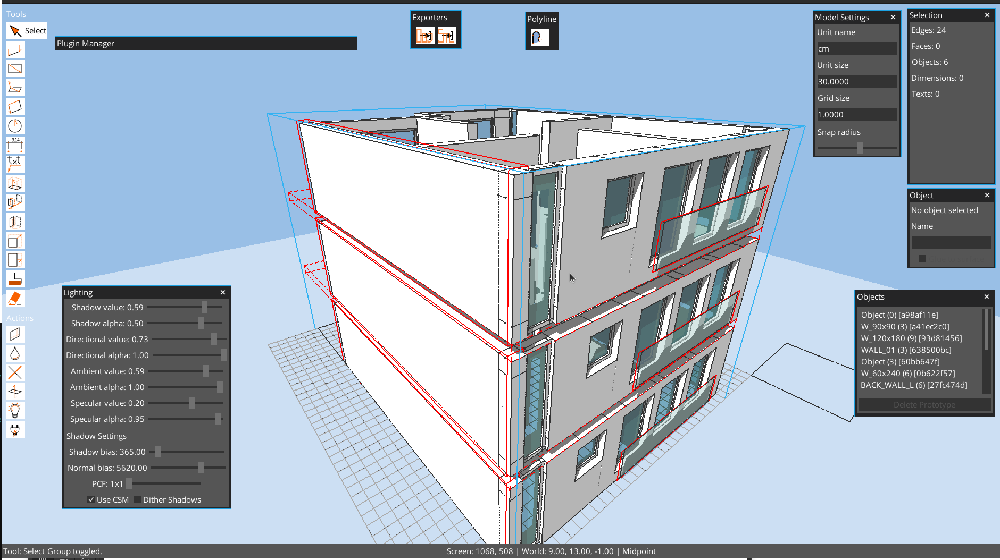
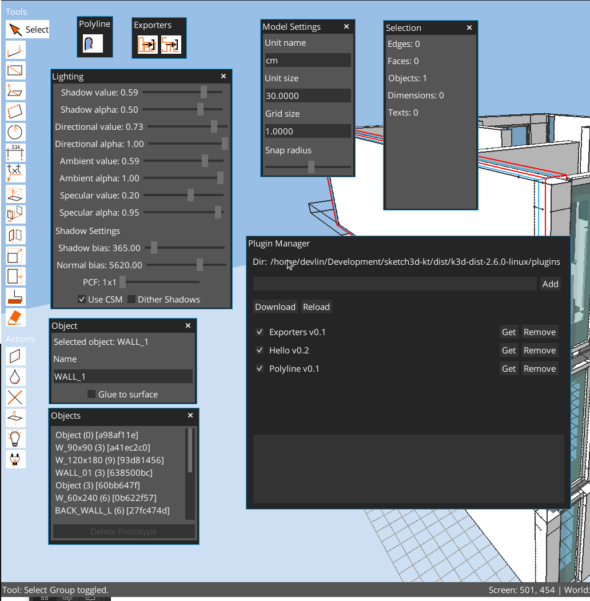

# K3D

K3D is a Kotlin + libGDX desktop modeler for fast, direct 3D sketching. It focuses on edges, planar faces, and tool-driven workflows with precise snapping, groups (objects), and a live Groovy console for power users.



## Highlights

- Direct modeling: draw edges, create faces, and push/pull solids.
- Precision: snapping to grid, endpoints, midpoints, lines, faces, and guides.
- Object workflow: group geometry into reusable object prototypes and instances.
- Measurements: linear dimensions, numeric input, and unit-aware modeling.
- Custom lighting and shadows with real-time controls.
- Groovy-powered dev console and plugin system.



## Core tools

- Select, Line, Rectangle, Surface Rectangle, Quad, Circle
- Push/Pull, Move, Rotate, Scale, Stretch
- Linear Dimension, Text, Paint, Object placement
- Eraser tool (placeholder in this build)

## Selection and snapping

- Click, window (left-to-right), crossing (right-to-left), and volume selection.
- Double-click groups to enter edit mode; double-click faces for coplanar selection; triple-click for connected geometry.
- Snap to grid intersections/lines, endpoints, midpoints, line segments, faces, and guides.
- Guides: `G` for grid guides, `T` for axis guides (Esc clears guides in Select mode).

## Objects (groups and prototypes)

- Create object prototypes from selection (`Ctrl+G` or `Ctrl+O`).
- Place instances via the Objects panel or Object tool.
- Edit an object by double-clicking an instance.
- Glue-to-surface option keeps objects aligned to a picked surface during moves.

## Panels and UI

- Selection, Object Info, Objects, Model Settings, Lighting, Plugin Manager.
- Action buttons: Cleanup, Delete, Flip Faces, Color, Lighting, Plugin Manager.
- Command Palette (`Ctrl+Shift+P`) for tools and panel actions.

## Built-in console (dev)

The dev console is a persistent Groovy REPL that runs alongside the GUI. Start it via the desktop launcher command:

```
edit --file path/to/model.k3d
```

Inside the console, type `:help` and `:examples` for meta commands and snippets. Use `app.run { ... }` to mutate the model safely.

## Files and autosave

- Default file: `sketch3d.k3d` in the working directory.
- Autosaves on geometry, selection, and settings changes.
- Model files store camera, lighting, shadow settings, units, and grid spacing.

## Downloads and running

Grab the latest release from GitHub Releases and run the platform launcher:

- Windows: `k3d-jre.cmd` (bundled runtime) or `k3d.cmd` (system Java)
- macOS / Linux: `./k3d-jre` (bundled runtime) or `./k3d-editor` (system Java)

## CLI commands (desktop launcher)

```
edit --file <path> [--size WIDTHxHEIGHT]   Open or create a model file
edit --plugins-dir <path>                 Override plugins folder
groovy <script>                           Run a Groovy script file
version                                  Show version information
update                                   Download and replace the editor jar
help                                     Show help
```

## Build from source

```
./gradlew build
./gradlew :lwjgl3:run
```

## Documentation

- User manual: `docs/USER_MANUAL.md`
- Shortcuts: `SHORTCUTS.md`
- Plugin development: `docs/PLUGIN_DEVELOPMENT.md`
- Specs: `docs/specification/`

## Status

K3D is an active work-in-progress. File formats and APIs may evolve as new modeling and topology features land.
