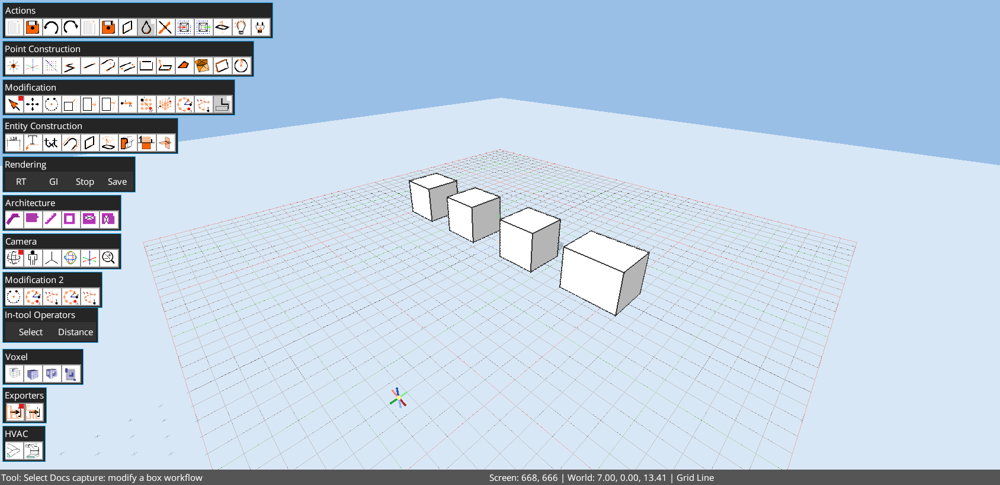
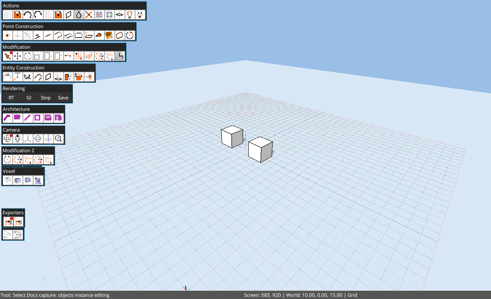

# Octodraw


[](https://snapcraft.io/octodraw)
<a href="https://get.microsoft.com/installer/download/9pgzhnkds3px?referrer=appbadge" target="_self">

</a>
<a href="https://play.google.com/store/apps/details?id=com.github.alfu32.sketch">

</a>

Octodraw is a Kotlin + libGDX direct 3D sketching and modeling project. It focuses on edges, planar faces, tool-driven workflows, precise snapping, objects/instances, and a live Groovy console for power users.

The current docs site lives in [`docs-site/`](docs-site/) and is the preferred place for user guidance, tutorials, reference material, and automation notes.



## Highlights

- Draw edges, create faces, and push/pull solids.
- Line workflows include chained `Line` and single-segment `Construction Line`.
- Surface-aligned rectangles, quads, and circles.
- Snap to grid, endpoints, midpoints, lines, faces, and guides.
- Objects with prototypes, instances, and edit mode.
- Linear dimensions and text entities.
- Scale supports axis-constrained squash/stretch when the reference direction is aligned with `X`, `Y`, or `Z`.
- Real-time lighting and shadow controls.
- Groovy dev console and plugin system.



## Core Tools

- Select, Line, Rectangle, Surface Rectangle, Quad, Circle
- Push/Pull, Move, Rotate, Scale, Stretch
- Object booleans: Solid Union, Solid Intersection, Solid Subtraction, Cut Objects
- Fuzzy tools: Random Offset, Random Surface Array, Mesh Regularize
- Linear Dimension, Text, Paint, Object placement
- Eraser tool

## Selection and Snapping

- Click, window, crossing, and volume selection.
- Double-click groups to enter edit mode; double-click faces for coplanar selection; triple-click for connected geometry.
- Snap to grid intersections/lines, endpoints, midpoints, line segments, faces, and guides.
- Guides: `G` for grid guides, `T` for axis guides.
- Undo/redo: `Ctrl+Z` / `Ctrl+Y` or `Ctrl+Shift+Z`.

## Objects

- Create object prototypes from selection (`Ctrl+G` or `Ctrl+O`).
- Place instances via the Objects panel or Object tool.
- Edit an object by double-clicking an instance.
- Glue-to-surface keeps objects aligned to a picked surface during moves.

## Panels and UI

- Selection, Object Info, Objects, Model Settings, Lighting, Plugin Manager.
- Action buttons: Cleanup, Delete, Flip Faces, Color, Lighting, Plugin Manager.
- Command Palette (`Ctrl+Shift+P`) for tools and panel actions.

## Built-In Console

The dev console is a persistent Groovy REPL that runs alongside the GUI. Start it via the desktop launcher command:

```sh
edit --file path/to/model.octd
```

Inside the console, type `:help` and `:examples` for meta commands and snippets. Use `app.run { ... }` to mutate the model safely. Use `:perf` to print memory, disk, thread, and CPU stats.

## Files and Autosave

- Default file: `octodraw.octd` in the working directory.
- Autosaves on geometry, selection, and settings changes.
- Model files store camera, lighting, shadow settings, units, and grid spacing.

## Downloads and Running

Get the latest release artifacts from GitHub Releases.

- Windows: `.zip`, `.msi`, `.msix`
- Linux: `.tar.gz` or `.zip`
- macOS: `.tar.gz` or `.zip`

## CLI Commands

```sh
edit --file <path> [--size WIDTHxHEIGHT]   Open or create a model file
edit --plugins-dir <path>                 Override plugins folder
groovy <script>                           Run a Groovy script file
version                                   Show version information
update                                    Download and replace the editor jar
help                                      Show help
```

## Build From Source

```sh
./gradlew build
./gradlew :lwjgl3:run
./gradlew :web:prepareWebComponentBundle
```

Web artifacts are written to `dist/` as:

- `octodraw-<version>-webapp.{zip,tar.gz}` for the TeaVM/WebGL runtime shell
- `octodraw-<version>-webdocs.{zip,tar.gz}` for the docs-only bundle

## Documentation

- Main docs: [alfu32.github.io/k3d/](https://alfu32.github.io/k3d/)
- Tutorials: [alfu32.github.io/k3d/tutorials/](https://alfu32.github.io/k3d/tutorials/)
- Guide: [alfu32.github.io/k3d/guide/](https://alfu32.github.io/k3d/guide/)
- Reference: [alfu32.github.io/k3d/reference/](https://alfu32.github.io/k3d/reference/)
- Automation: [alfu32.github.io/k3d/automation/](https://alfu32.github.io/k3d/automation/)
- Specification: [alfu32.github.io/k3d/specification/](https://alfu32.github.io/k3d/specification/)
- Local source docs: [`docs/`](docs/)
- Docs site source: [`docs-site/`](docs-site/)

## Status

Octodraw is an active work-in-progress. File formats and APIs may evolve as new modeling and topology features land.
