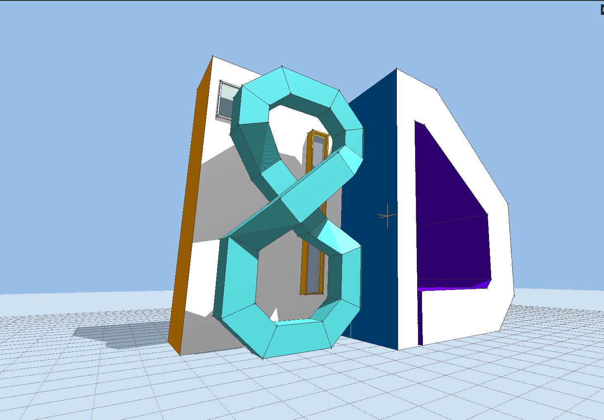
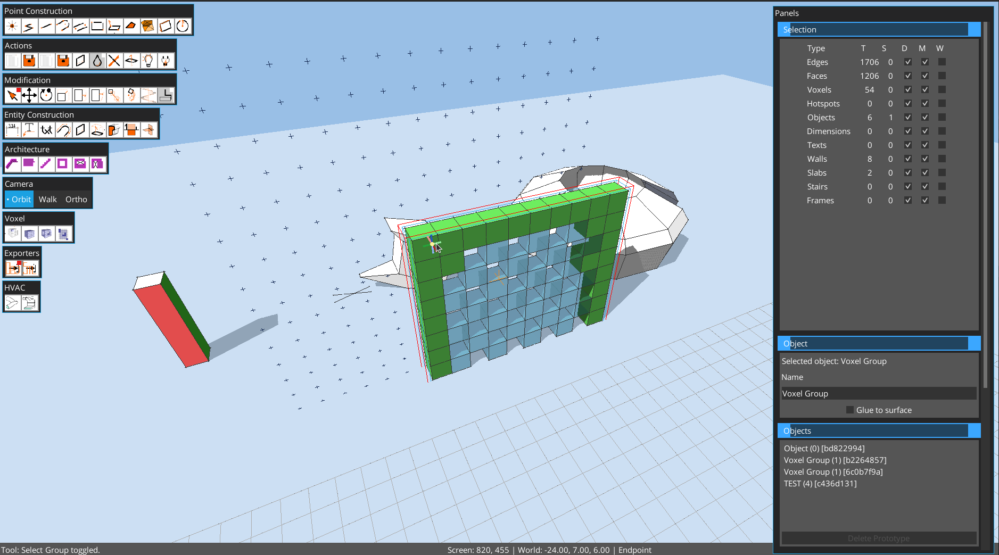
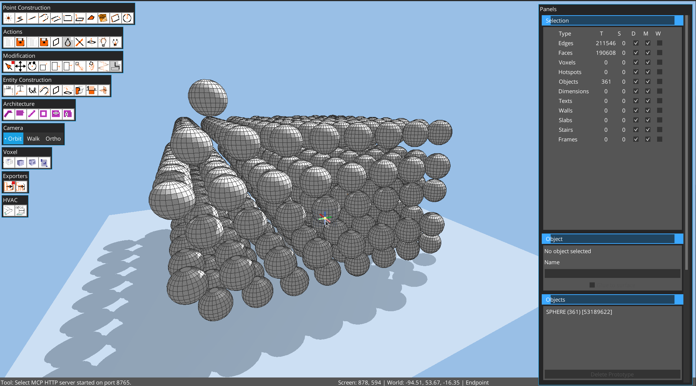
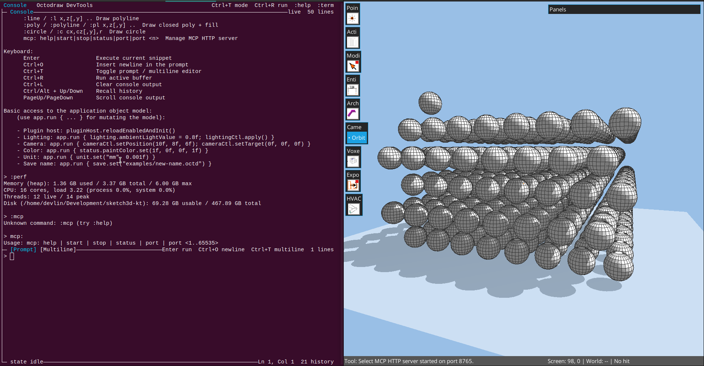
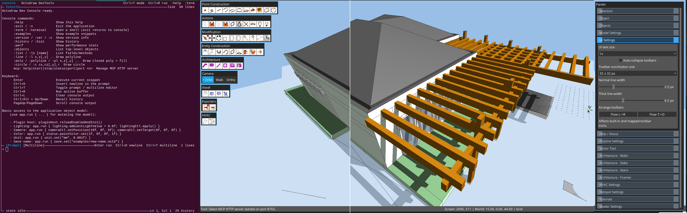
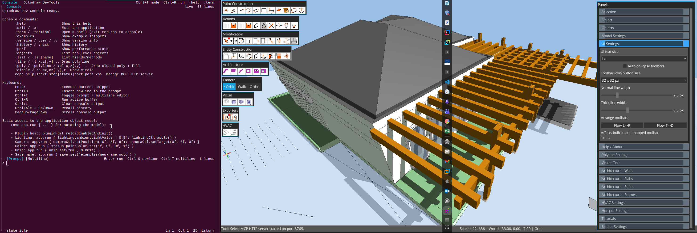
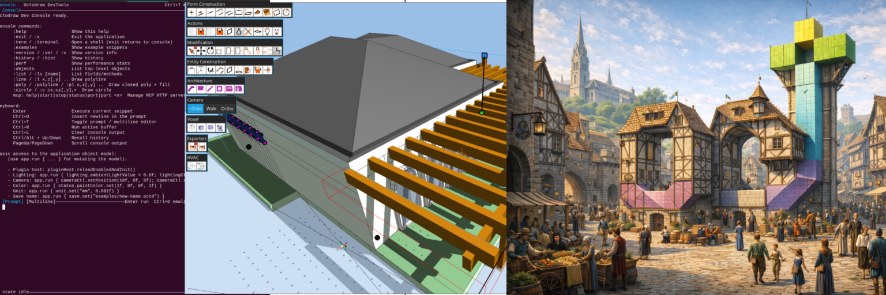
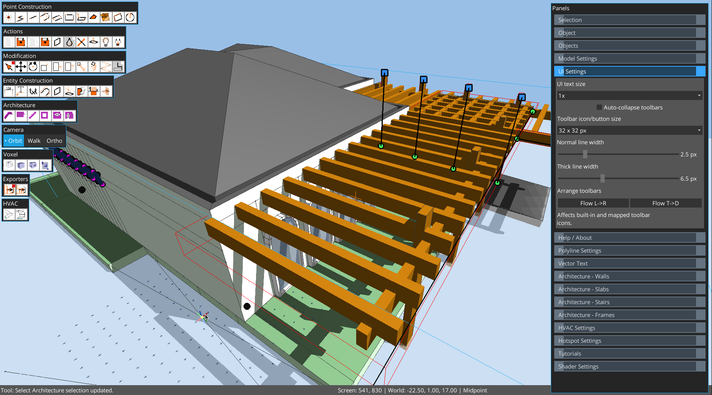

# Octodraw User Manual



This manual covers installation, navigation, selection, tools, panels, and workflows for Octodraw.


## Installation and launch

### Windows (ZIP / MSI / MSIX)

1. ZIP: unzip the distribution archive.
2. MSI/MSIX: install the package from the release artifacts.
3. Run `octodraw-jre.cmd` to use the bundled runtime, or `octodraw.cmd` to use a system Java.
4. Optional (ZIP only): run `octodraw.install.cmd` to add Octodraw to PATH and register `.octd` files.

### Linux (TAR.GZ recommended)

1. Extract the `.tar.gz` distribution archive (preferred, preserves executable flags).
2. If you used a ZIP, make the launcher executable: `chmod +x octodraw-jre octodraw-editor`.
3. Run `./octodraw-jre` for the bundled runtime, or `./octodraw-editor` for system Java.

### macOS (TAR.GZ recommended)

1. Extract the `.tar.gz` distribution archive (preferred, preserves executable flags).
2. If you used a ZIP, make the launcher executable: `chmod +x octodraw-jre octodraw-editor`.
3. Run `./octodraw-jre` for the bundled runtime, or `./octodraw-editor` for system Java.

### Launch commands

The desktop launcher supports commands and flags:

```
edit --file <path> [--size WIDTHxHEIGHT]   Open or create a model file
edit --plugins-dir <path>                 Override plugins folder
groovy <script>                           Run a Groovy script file
version                                  Show version information
update                                   Download and replace the editor jar
help                                     Show help
```

You can also pass a `.octd` path directly (the launcher converts it into `--file`).

### Plugins location

- Default plugin folder: `plugins/` next to the application.
- Override the location with: `--plugins-dir /path/to/plugins`.

## Files and autosave

- Default model file: `octodraw.octd` in the current working folder.
- Open a specific file with: `--file /path/to/model.octd`.
- Octodraw autosaves whenever geometry or settings change.
- Model files store: geometry, objects, camera, lighting, shadow settings, units, snap radius, and grid spacing.

## UI overview

- Viewport: the 3D drawing surface.
- Floating toolbars: **Construction**, **Modification**, **Architecture**, **Voxel**, and **Actions**.
- Toolbars are movable, stay top-aligned by default, and wrap to the next row when the window is too narrow.
- Tool buttons are icon-only; hold hover briefly to see the popover label.
- Right panels: selection, object info, objects list, model settings, polyline settings, architecture settings, lighting, plugins.
- Status bar: current tool, status message, snap info, cursor, and numeric input.
- Command palette: search and run tools and commands (`Ctrl+Shift+P`).
- Undo/Redo: `Ctrl+Z` / `Ctrl+Y` (or `Ctrl+Shift+Z`).

Panels are collapsible: double-click a panel title bar to toggle its content. Collapse/expand keeps the title bar anchored in place.
Keyboard focus is panel-aware: typing in focused fields stays in UI controls, while viewport shortcuts apply when the cursor is over the canvas.


## Architecture tools brief

- Architecture elements are parametric objects stored in architecture groups.
- Main tools: `Wall`, `Slab`, `Stair`, `Add Hole`, `Window Frame`, `Door Frame`.
- Architecture defaults and selected-element parameters are edited in the **Architecture Settings** panel.
- You can edit architecture element parameters by selecting the element/group; entering group edit mode is not required for parameter updates.
- Wall and stair generation are contour/path driven, with automatic rebuild after parameter changes.

## Navigation (camera)

- Orbit: right mouse drag.
- Pan: Shift + right mouse drag.
- Zoom: mouse wheel (moves the camera along the view direction).
- Camera target: shown as an orange cross in the scene.

## Selection

- Click to select edges, faces, objects, dimensions, and texts.
- Shift-click: add to selection.
- Ctrl-click: remove from selection.
- Double-click an object: enter object edit mode.
- Double-click a face: select coplanar faces.
- Triple-click a face or edge: select connected geometry.

### Window selection

- Drag left-to-right: select items fully inside the window.
- Drag right-to-left (dashed outline): select intersecting items.
- Hold `Alt` while starting selection to force 2D window selection and skip direct picking.

### Volume selection

- Click empty space once to set a first corner.
- Click a second point to select everything inside that 3D volume.

### Selection in voxel groups

- In a voxel group, selection targets voxels directly (not generated faces/edges).
- Click toggles voxel selection; Shift/Ctrl and window/volume selection still apply.
- `Delete` removes selected voxels.
- Move/Copy works on selected voxels using integer voxel offsets in local voxel space.



## Snapping and guides

Octodraw snaps to multiple inference targets for precision:

- Grid intersections and grid lines.
- Line endpoints and midpoints.
- Points along line segments.
- Faces and ground plane intersections.
- Grid guides and axis guides.

Guides help establish temporary reference planes or axes:

- `G`: create a grid guide at the current snap point.
- `T`: create an axis guide at the current snap point.
- `Esc` (Select tool): clear all guides.

Snap radius and grid spacing are configurable in **Model Settings**.



## Numeric input

- While a tool is active, typing a number updates the current measurement.
- `Backspace` clears the input buffer; `Enter` commits it.
- `Ctrl+N` opens a numeric input popup at the cursor.
- Expressions using `+ - * /` are supported (example: `12.5/2`).



## Objects (groups and prototypes)

Objects let you reuse geometry and isolate edits.

- Create an object prototype from selection: `Ctrl+G` or `Ctrl+O`.
- The selection is replaced by a new instance.
- Objects panel lists prototypes and instance counts.
- Double-click a prototype in the list to place a new instance.
- Delete a prototype only when it has no instances.
- Renaming a selected object updates the prototype name.
- Double-click an instance to edit the prototype (changes apply to all instances).
- **Glue to surface** keeps objects aligned to a picked surface during moves.



## Hotspots and visual programming (dynamic objects)

Hotspots are parametric control handles used inside object prototypes and on object instances.

- A prototype defines geometry + hotspots + hotspot bindings.
- Each instance stores its own hotspot positions.
- Instance geometry is recomputed from the prototype baseline using per-instance hotspot values.

### Core workflow

1. Enter object edit mode (double-click an instance).
2. Use the **Hotspot** action button, then click in the viewport to place a hotspot.
3. In **Hotspot Settings**, choose:
   - name,
   - operation,
   - shape,
   - color.
4. Select geometry and click **Attach Selection** to bind it to the selected hotspot.
5. (Optional) Select multiple hotspots, then click **Attach Selection** on one hotspot to bind hotspot-to-hotspot dependencies.
6. (Optional) Click **Pick Reference** for operations that need a center/reference.
7. Exit object edit mode, then drag hotspot handles on instances to drive per-instance deformation.

### Hotspot operations

- `MOVE`: translate attached geometry.
- `STRETCH`: stretch attached geometry with vertex-aware behavior.
- `SCALE`: scale around reference (or origin when no reference is set).
- `ROTATE`: rotate around reference.
- `MULTIPLY_LINEAR`: replicate attached geometry along hotspot span.
- `MULTIPLY_VOLUMETRIC`: replicate attached geometry in a filled extent volume.
- `MULTIPLY_ROTATE_2D`: replicate along an arc around reference.
- `MULTIPLY_ROTATE_3D`: replicate along a spiral-like path around reference with height progression.

### Hotspot shapes and colors

Available shapes:

- triangle up,
- square,
- circle,
- diamond,
- triangle down.

You can set shape/color globally as defaults (no hotspot selected) or per selected hotspot.

### Notes

- Multiply operations generate derived instance geometry at runtime from bindings.
- For predictable results, bind explicit geometry (edges/faces) before using multiply operations.
- Hotspot binding state is saved with the model and restored on reopen.

## Tools

### Select

- Default tool for selection and multi-select.
- Input: left-click for single select; drag for window/crossing selection; click empty space twice for volume selection.
- Modifiers: Shift adds, Ctrl removes, Alt forces 2D window select; Esc clears guides and selection.

### Line

- Click to start a line chain; each click adds another segment.
- Line tool creates edges only and does not auto-create faces.
- `Enter` finishes the current chain and keeps the tool active.
- `Esc` exits to Select.
- Input: left-click to place each segment endpoint.
- Modifiers: numeric input allowed for segment length.

### Construction Line

- Draws one segment per two clicks and does not auto-chain to the next segment.
- Tool stays active after each segment so you can place independent construction lines quickly.
- `Enter` clears an in-progress segment.
- `Esc` exits to Select.
- Input: left-click start, left-click end.

### Voxel

- Places one voxel per click on ground/surface context.
- If no voxel group is active, Octodraw auto-creates one and enters voxel edit mode.
- New voxels use the voxel group color.
- `Esc` exits to Select.
- Input: left-click to place.

### Voxel Volume

- Fills a rectangular 3D volume of voxels from two opposite corners.
- First click sets corner A, second click sets corner B and commits.
- If no voxel group is active, Octodraw auto-creates one and enters voxel edit mode.
- `Enter` clears the current draft; `Esc` exits to Select.
- Input: left-click corner A, left-click corner B.

### Voxel Frame

- Same two-corner workflow as Voxel Volume, but creates only boundary edge voxels of the box.
- If no voxel group is active, Octodraw auto-creates one and enters voxel edit mode.
- `Enter` clears the current draft; `Esc` exits to Select.
- Input: left-click corner A, left-click corner B.

### Wall

- Adds architecture wall segments (thickness, height, inclination from Architecture Settings).
- First click sets segment start, second click sets end and creates one wall segment.
- Tool chains by default: each next click continues from the previous endpoint.
- If no architecture group is active, Octodraw auto-creates one and enters architecture edit mode.
- `Enter` finishes the current chain; `Esc` exits to Select.

### Slab

- Creates a rectangular slab from two opposite corners.
- Slab thickness comes from Architecture Settings.
- If no architecture group is active, Octodraw auto-creates one and enters architecture edit mode.
- `Enter` clears the current draft; `Esc` exits to Select.

### Stair

- Builds a stair object in four picks:
  1. first contour corner,
  2. opposite contour corner,
  3. walking line start,
  4. walking line end (commit).
- Stair height, step count, and support thickness come from Architecture Settings.
- If no architecture group is active, Octodraw auto-creates one and enters architecture edit mode.
- `Enter` resets the current draft; `Esc` exits to Select.

### Add Hole

- Cuts a rectangular hole in the nearest compatible wall from two opposite corners.
- Hole selection/deletion workflow:
  - selecting and deleting a hole contour removes the hole definition from the wall;
  - deleting generic generated wall faces/edges is blocked to preserve parametric architecture integrity.
- If no architecture group is active, Octodraw auto-creates one and enters architecture edit mode.
- `Enter` clears the current draft; `Esc` exits to Select.

### Window Frame

- Creates a rectangular window frame from two opposite corners.
- Frame depth and width come from Architecture Settings.
- If no architecture group is active, Octodraw auto-creates one and enters architecture edit mode.
- `Enter` clears the current draft; `Esc` exits to Select.

### Door Frame

- Creates a rectangular door frame from two opposite corners.
- Frame depth and width come from Architecture Settings.
- If no architecture group is active, Octodraw auto-creates one and enters architecture edit mode.
- `Enter` clears the current draft; `Esc` exits to Select.

### Rectangle

- Click to set a corner; click to finish the rectangle.
- Creates edges and a face on the best-fit plane.
- Input: left-click two corners.
- Modifiers: numeric input allowed for side length.

### Surface Rectangle

- Click a surface to set plane and origin; click to finish the rectangle.
- Creates edges and a face aligned to the picked surface.
- Input: left-click on a face, then left-click to set size.

### Quad

- Click four corners to create a quadrilateral face.
- Input: four left-clicks to define corners.

### Circle

- Click center, then click radius to create a circular face.
- Input: left-click center, left-click radius.

### Linear Dimension

- Click first measure point.
- Click second measure point.
- Click a third point to position the dimension line.
- The displayed value uses the current model unit.
- Input: three left-clicks (start, end, placement).
- Modifiers: numeric input can override the measured distance.

### Text

- Click to place text at the cursor plane.
- Edit content, size, and screen/model mode in the Selection panel.
- Input: left-click to place.
- Modifiers: edit text, size, and screen/model toggle in Selection panel.

### Push/Pull

- Click a face to start; click again to set the extrusion distance.
- Input: left-click face, left-click to confirm distance.
- Modifiers: numeric input overrides distance.

### Move

- Click a reference point, then click a destination.
- `Ctrl` toggles copy mode (if enabled, copies instead of moving).
- In voxel groups, selected voxels move/copy on integer voxel offsets.
- Input: left-click start, left-click end.
- Modifiers: Ctrl toggles copy mode; numeric input overrides distance.

### Rotate

- Click to set a pivot; click again to set the rotation.
- `Ctrl` toggles copy mode (if enabled, duplicates before rotating).
- Input: left-click pivot, left-click to set angle.
- Modifiers: Ctrl toggles copy mode; numeric input overrides angle.

### Scale

- Click to set a pivot; click again to set the scale.
- `Ctrl` toggles copy mode (if enabled, duplicates before scaling).
- If the reference direction is axis-aligned (`X`, `Y`, or `Z`), scaling is constrained to that single axis (squash/stretch).
- Otherwise scaling uses the existing plane/uniform constrained behavior.
- Input: left-click pivot, left-click to set scale.
- Modifiers: Ctrl toggles copy mode; numeric input overrides factor.

### Stretch

- Move only the selected vertices or faces while preserving unselected geometry.
- Input: left-click reference, left-click destination.
- Modifiers: numeric input overrides distance.

### Stretch Scale

- Scales selected geometry using the normal Scale point workflow.
- Connected vertices belonging to unselected entities are transformed when they share selected vertices, which makes it useful for resizing part of a mesh without disconnecting neighboring faces or segments.
- Input: same point sequence as Scale.

### Paint

- Click a face to apply the active color.
- Use the Color action button to pick the active color.
- In voxel groups:
  - if voxels are selected, Paint recolors only selected voxels;
  - if no voxels are selected, Paint applies the color to the whole voxel model.
- Input: left-click face to paint.

### Volume Tools

- Solid Union, Solid Intersection, and Solid Subtraction operate on two selected mesh object instances in the same parent context.
- Cut Objects runs the shared intersection-cut step and leaves all resulting fragments selected without classifying or deleting faces.
- Boolean results are written back as loose selected geometry, not as a new object. Group the result only after inspecting and cleaning it.
- Best results require coherent face normals and operands that describe usable volumes.

### Fuzzy Tools

- Random Offset moves selected connected vertices along averaged neighboring face normals. Use a low strength first and increase only after checking the direction of the deformation.
- Random Surface Array scatters selected payload geometry across selected target faces. Controls include copy count, normal alignment, scale variation, and rotation variation.
- Mesh Regularize replaces a near-planar selected patch with a regular rectangular triangle grid. Non-planar selections should be split into smaller patches before regularization.

### Object

- Places object prototypes into the scene after choosing one in the Objects panel.
- Input: left-click to place the selected prototype instance.



## Architecture tools (detailed, tool by tool)

### Architecture workflow context

- Architecture tools operate on architecture groups.
- If a required architecture group is missing, creation tools can auto-create one and continue.
- The **Architecture Settings** panel shows either default construction values (no architecture element selected) or selected-element values (when exactly one architecture element is selected).
- Parameter changes trigger a live rebuild of the selected architecture element.

### Wall tool

- Purpose: create multi-segment walls using chained picks.
- Input flow:
  - click first wall point,
  - click end point to create one segment,
  - continue clicking to chain additional segments.
- `Enter`: finish current chain and keep Wall tool active.
- `Esc`: cancel and return to Select.
- Driven by panel parameters:
  - wall thickness,
  - wall height,
  - wall inclination,
  - exterior/interior colors.
- Wall joins are rebuilt in 3D when neighboring segments meet.

### Slab tool

- Purpose: create rectangular slab geometry from two corners.
- Input flow:
  - click first slab corner,
  - click opposite corner to commit.
- `Enter`: clear current draft.
- `Esc`: cancel and return to Select.
- Driven by panel parameters:
  - slab thickness,
  - slab top/bottom/side colors.

### Stair tool

- Purpose: create ribbon-style stairs from a contour and a tread path.
- Input flow:
  - pick a closed contour polyline (preferred: whole polyline/group pick),
  - pick an open tread-line polyline.
- The generator divides the tread path by step count, builds per-step orientation from each local segment, trims each step to contour intersections, and builds tread/support geometry.
- If side cross-lines meet before contour intersection, the step section collapses to a triangle automatically.
- Support and backface are generated as a continuous ribbon with special handling at the first/last steps.
- Rail grid options:
  - left and right rails can be toggled independently in Architecture Settings,
  - rails are generated at +1, +2, +3, +4 model units above each step top edge.
- Driven by panel parameters:
  - stair height,
  - stair steps,
  - support thickness,
  - left/right rail enable,
  - tread/support colors.

### Add Hole tool

- Purpose: cut rectangular holes in compatible walls.
- Input flow:
  - click first corner on/near wall face,
  - click opposite corner to commit.
- If a wall is selected, hole is added to that wall; otherwise nearest compatible wall is used.
- Tool is restricted to wall-only architecture groups.
- `Enter`: clear current draft.
- `Esc`: cancel and return to Select.

### Window Frame tool

- Purpose: create a parametric rectangular window frame.
- Input flow:
  - click first frame corner,
  - click opposite corner to commit.
- Frame is built on the picked construction plane.
- Driven by panel parameters:
  - frame depth,
  - frame width,
  - frame color.
- `Enter`: clear current draft.
- `Esc`: cancel and return to Select.

### Door Frame tool

- Purpose: create a parametric rectangular door frame.
- Input flow:
  - click first frame corner,
  - click opposite corner to commit.
- Frame is built on the picked construction plane.
- Uses the same frame parameters as Window Frame:
  - frame depth,
  - frame width,
  - frame color.
- `Enter`: clear current draft.
- `Esc`: cancel and return to Select.

### Editing architecture elements

- Select an architecture element/group, then adjust parameters in **Architecture Settings**.
- Walls/slabs/stairs/frames update in place when values change.
- For stairs, rail toggles and colors are also editable post-creation.

## Actions and panels

### Actions (toolbar)

- **Cleanup**: split intersections and re-weld edges.
- **Delete**: delete current selection.
- **Flip Faces**: reverse the orientation of selected faces.
- **Color**: open the paint color picker.
- **Hotspot**: start hotspot placement (click in viewport to place).
- **Voxelize Faces**: convert selected mesh faces into voxels.
  - Works from any mesh context.
  - If no voxel group is active, Octodraw creates one and enters it.
  - Generated voxels use the target voxel-group color.
- **Lighting**: toggle the Lighting panel.
- **Plugin Manager**: open the Plugin Manager panel.
Shortcut notes: `Ctrl+L` runs Cleanup; `Delete` removes selection; flip/color/voxelize are toolbar/command-palette actions.

### Selection panel

- Counts for edges, faces, voxels, hotspots, objects, dimensions, and texts.
- Text fields to edit text content and size.
- Toggle for screen-aligned vs model-aligned text.
Input: click fields to edit; checkbox toggles screen-aligned text.

### Object Info panel

- Shows selected object name and edit state.
- Rename objects and toggle **Glue to surface**.
Input: click name field to edit; checkbox toggles glue.

### Objects panel

- Lists object prototypes and instance counts.
- Double-click a prototype to place an instance.
- Delete a prototype only when it has no instances.
Input: double-click to place; Delete Prototype button removes selection (when allowed).

### Model Settings panel

- Unit name and unit size for measurements.
- Grid size (spacing).
- Snap radius (snap tolerance).
Input: type values in fields; drag Snap radius slider.

### Hotspot Settings panel

- Shows either:
  - default hotspot settings (when no hotspot is selected), or
  - selected hotspot settings.
- Controls:
  - hotspot name,
  - operation,
  - shape,
  - color (text field + picker),
  - attached geometry counters,
  - reference state.
- Actions:
  - **Attach Selection**
  - **Select Attached**
  - **Pick Reference**
  - **Clear Reference**
  - **Add At Cursor**
  - **Delete Selected**

### Lighting panel

- Directional, ambient, specular, and shadow controls.
- Shadow bias, normal bias, PCF mode, dithering, and cascades toggle.
Input: drag sliders and toggles for live updates.

### Plugin Manager panel

- Add plugin URLs or local paths.
- Download, enable/disable, and reload plugins.
- View load errors in the panel log.
Input: type a URL/path, click Add; use Download/Reload buttons and enable checkboxes.



## Command palette

Open with `Ctrl+Shift+P` and search for tools, panels, and view commands. The palette also exposes plugin commands when available.
Input: type to filter, Enter to run the highlighted command.

Useful voxel commands:

- `Edit> New Voxel Group`: create a voxel group and enter edit mode.
- `Edit> Voxelize Faces`: voxelize selected faces into a voxel group.

## Built-in console (dev)

Octodraw includes a persistent Groovy console for power users. Start it using the launcher command:

```
edit --file path/to/model.octd
```

In the console:

- Type `:help` for meta commands.
- Type `:examples` for snippets.
- Use `app.run { ... }` to mutate the model safely.
Input: Enter submits when syntax is complete; Up/Down navigates history if the buffer is empty; Ctrl+Up/Down always navigates history.

Common meta commands:

- `:help` / `:examples`
- `:exit` to quit the app
- `:history` to list prior commands
- `:perf` to show memory, disk, threads, and CPU stats
- `:objects` to list top-level objects
- `:list` to inspect bound variables
- `:line`, `:poly`, `:circle` to draw geometry

Useful bindings:

- `app`, `scene`, `selection`, `console`
- `pluginHost`, `lighting`, `shadow`, `lightingCtl`
- `camera`, `cameraTarget`, `cameraCtl`
- `status`, `unit`, `save`, `version`



## Plugins

Octodraw loads Groovy plugins from the plugins folder at startup and via the Plugin Manager.

- Use the Plugin Manager to add, download, enable/disable, and reload plugins.
- Plugin tools appear in the toolbar and command palette.
- For development details, see [`PLUGIN_DEVELOPMENT.md`](PLUGIN_DEVELOPMENT.md).

## Voxel workflow (recommended)

1. Start from mesh geometry or an empty file.
2. Create a voxel group (`Edit> New Voxel Group`) or just start with a voxel tool (auto-creates group).
3. Build with:
   - `Voxel` for single blocks,
   - `Voxel Volume` for solid box fills,
   - `Voxel Frame` for box edge structures.
4. Refine with Select + Move/Copy + Paint at voxel level.
5. Convert mesh patches with **Voxelize Faces** when needed.
6. When ready for classic mesh editing, select voxel group(s) and ungroup (`Ctrl+Shift+G`) to explode into static faces/lines.

## Tips and troubleshooting

- If a panel field is focused, move the cursor over the viewport to apply canvas shortcuts (`Esc`, `Delete`, tool keys).
- If snapping is too aggressive, reduce **Snap radius** in Model Settings.
- If guides clutter the view, press `Esc` in Select mode to clear them.
- If a plugin fails to load, open Plugin Manager and read the error log.

For keyboard shortcuts, see [`SHORTCUTS.md`](SHORTCUTS.md).
