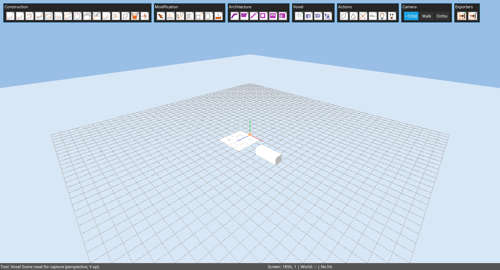
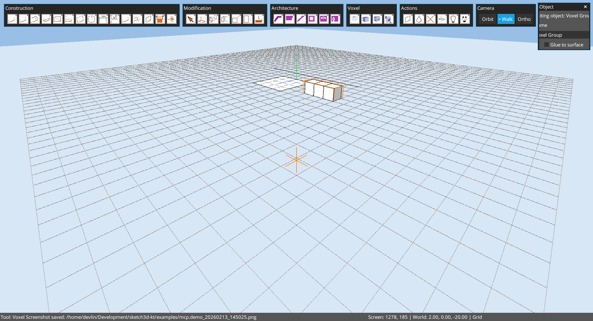

# Chapter 03: Files, Save, and Recovery

Author: Codex (GPT-5)
Date: February 13, 2026

## Goal
Document how `.octd` files are saved, backed up, and recovered.

## File Format
- Model extension: `.octd`
- Snapshot includes:
  - geometry and object hierarchy,
  - camera + target,
  - lighting/shadow settings,
  - unit name/size, snap radius, grid spacing,
  - undo history snapshot.
- Snapshot schema version in current code: `11` (`ModelPersistence.VERSION`).

## Save Behavior
`Main.saveModel()` calls `ModelPersistence.save(...)` and then dispatches plugin save hooks.

High-level save triggers include:
- geometry edits,
- object/group operations,
- many tool commits,
- explicit cleanup/transform operations.

## Load Behavior and Backup
`Main.loadModel()` behavior:
1. If target file exists, create backup `<file>.bak` first.
2. Load model snapshot.
3. If snapshot is missing newer fields, auto-resave in current format.
4. If file does not exist, create a new model file.

## Practical Example
Captured state from a save-ready modeling step:

A grouped object/prototype state:

## Recovery Checklist
1. If open fails, try `<model>.octd.bak`.
2. Confirm file is non-empty.
3. Reopen with `edit --file <path>`.
4. If needed, run cleanup and save a fresh copy under a new filename.

## Notes for MCP/Automation
- Set active model path via `save.set("examples/mcp.demo.k3d")` in console scripts.
- For deterministic runs, always reset scene and camera before test steps.
