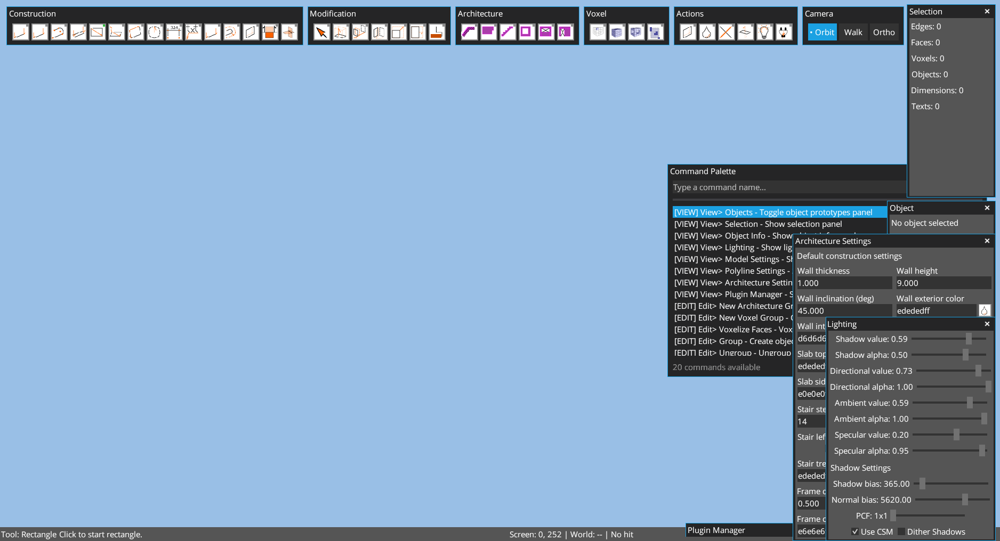
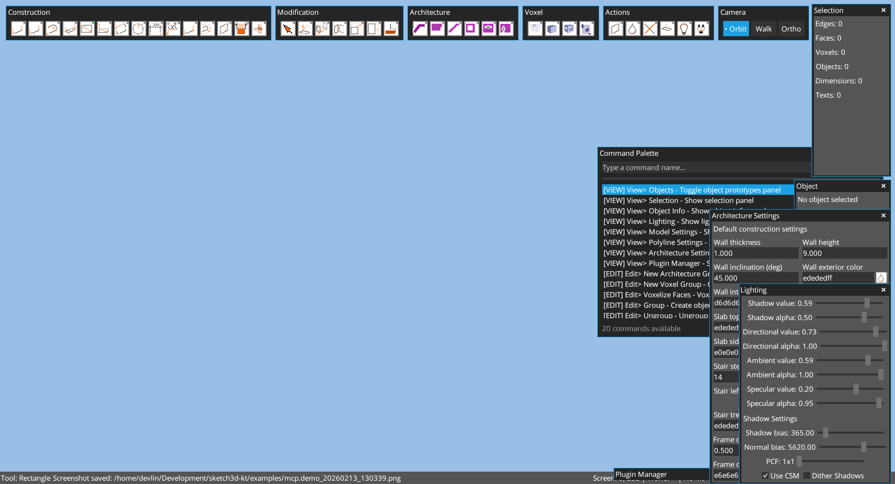
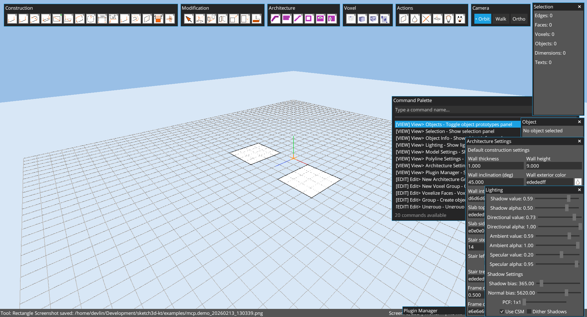
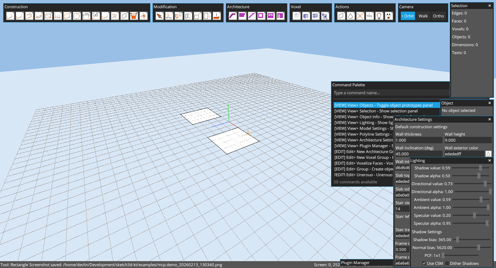
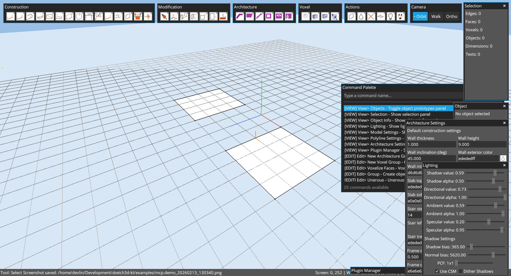
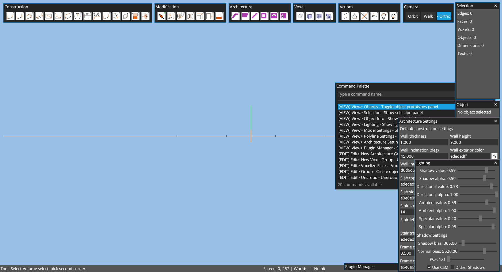
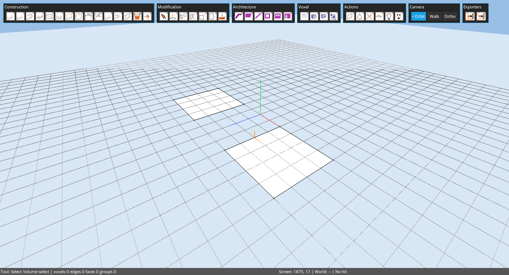

# Chapter 05: Interaction Fundamentals (Mouse + Keyboard)

Author: Codex (GPT-5)
Date: February 13, 2026

## Goal
Document core interaction behavior with practical examples captured through MCP operations on `examples/mcp.demo.k3d`.

## Capture Policy
- Screenshots use **perspective orbit camera** for user-facing clarity.
- Up axis is **Y** (`0,1,0`), depth axis is **Z**.

## Chapter Cleanup
Before this chapter, scene state is reset with `edit.reset_scene_for_capture` when available.
Fallback script for older runtimes:

```groovy
app.run {
  while (scene.exitGroup()) {}
  scene.resetScene()
  def rp = scene.rootPrototype()
  rp.lineStore.clearAll()
  rp.faceStore.clearAll()
  rp.dimensionStore.clearAll()
  rp.textStore.clearAll()
  scene.root.children.clear()
  scene.clearAllSelections()
  save.set("examples/mcp.demo.k3d")
  cameraCtl.setPosition(18f, 14f, 18f)
  cameraCtl.setTarget(0f, 0f, 0f)
  camera.up.set(0f, 1f, 0f)
  camera.lookAt(0f, 0f, 0f)
  camera.update()
}
```

## Practical Example Steps

### 1) Create two primitives for interaction testing
- Tool: `tool.builtin.rectangle`
- Rectangle A: `(-6,0,0)` to `(-2,0,4)`
- Rectangle B: `(2,0,0)` to `(6,0,4)`



### 2) Orbit view baseline
- Camera mode: `view.camera.orbit`
- Camera set to `(16,11,16)` looking at `(0,0,0)`



### 3) Pan effect demonstration
- Camera translated to `(20,11,12)` with target `(4,0,0)`
- Equivalent user gesture in Orbit mode: `Shift + Right Mouse Drag`



### 4) Zoom effect demonstration
- Camera moved closer to `(10,7,8)` with target `(2,0,2)`
- Equivalent user input: mouse wheel zoom



### 5) Single selection
- Tool: `tool.builtin.select`
- Pointer click near `(-4,0,2)`


### 6) Second selection click
- Pointer click near `(4,0,2)`



### 7) Window-selection pass
- Pointer drag from `(-9,0,-2)` to `(9,0,6)`
- Equivalent user interaction:
  - left-to-right drag = inside-only
  - right-to-left drag = crossing select



### 8) Volume-selection preview pass
- First corner click near `(-10,0,-6)`
- Move toward `(10,6,6)` then confirm
- Equivalent user interaction:
  - click empty space for corner A
  - move pointer to preview volume
  - click corner B to commit



## Keyboard Interaction Matrix (From Source)
Source: `core/src/main/kotlin/com/github/alfu32/sketch/ui/ToolInputProcessor.kt` and camera controllers.

- `Ctrl+Shift+P`: Command palette
- `Esc`: cancel active tool, clear selection/guides, exit object edit
- `Delete`: delete selection
- `Ctrl+Z`: undo
- `Ctrl+Y` / `Ctrl+Shift+Z`: redo
- `Ctrl+G`: group selection
- `Ctrl+Shift+G`: ungroup selection
- `Ctrl+O`: create object prototype from selection
- `Ctrl+L`: cleanup model
- `Ctrl+N`: numeric popup input
- `T`: add axis guide at current snap
- `G`: add grid guide at current snap
- Numeric typing: direct tool input (`0-9`, `.`, `-`, `Enter`, `Backspace`)

## Camera Input Summary
- Orbit camera: right drag orbit, `Shift + right drag` pan, wheel zoom
- Walkthrough camera: right drag look, `W/A/S/D` + arrows move, `Space` jump, `Up/Down` height adjust
- Orthographic camera: right drag orbit, middle drag pan (or shift-pan), wheel zoom

## Note About MCP Coverage
Current MCP endpoints include pointer and command execution, but no dedicated keyboard-event endpoint. Keyboard interactions in this chapter are documented from implementation and mapped to practical visual outcomes.

## Runtime Compatibility Note
- On runtimes before the `SelectTool` MCP drag fix, window/volume preview overlays may not render even if selection results are applied.
- On runtimes before the `SketchUiOverlay` capture-mode patch, the Object panel can reappear during capture frames.
