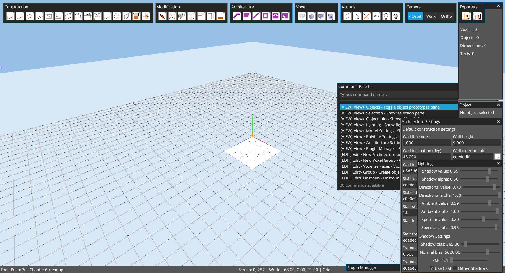
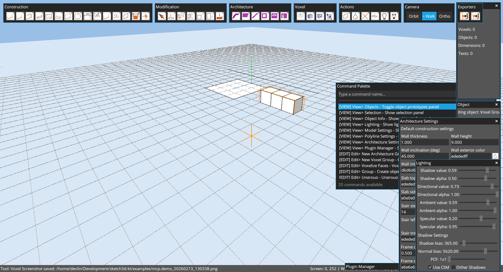
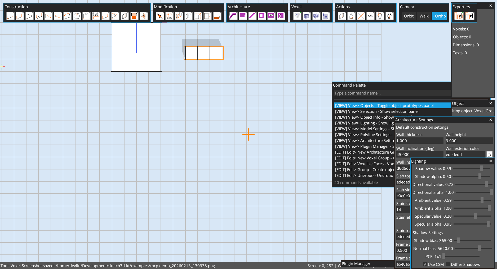

# Chapter 06: Toolbar and Button Reference

Author: Codex (GPT-5)
Date: February 13, 2026

## Goal
Map toolbar buttons to practical operations and show visible outcomes for each operation.

## Chapter Cleanup
Before this chapter, scene state was reset:

```groovy
app.run {
  scene.resetScene()
  save.set("examples/mcp.demo.k3d")
  cameraCtl.setPosition(14f, 12f, 14f)
  cameraCtl.setTarget(0f, 0f, 0f)
}
```



## Practical Button Operations

### 2) Construction toolbar: Line
- Command: `tool.builtin.line`
- Pointer from `(-6,0,-2)` to `(6,0,-2)`


### 3) Construction toolbar: Rectangle
- Command: `tool.builtin.rectangle`
- Pointer from `(-2,0,0)` to `(2,0,4)`


### 4) Voxel toolbar: Voxel
- Command: `tool.builtin.voxel`
- Voxel placements near `(4,0,2)`, `(5,0,2)`, `(6,0,2)`


### 5) Camera toolbar: Walk
- Command: `view.camera.walkthrough`
- Camera moved to `(10,6,10)` facing origin



### 6) Camera toolbar: Ortho + Top
- Commands: `view.camera.orthographic`, `view.ortho.top`



### 7) Actions toolbar behavior
- Commands used to open related panels:
  - `view.selection`
  - `view.model_settings`
  - `view.lighting`
  - `view.plugin_manager`


## Toolbar Button Map
Source: `core/src/main/kotlin/com/github/alfu32/sketch/ui/SketchUiOverlay.kt`.

### Construction
- `Line`, `Construction Line`, `Polyline`, `Double Line`, `Rectangle`, `Surface Rect`, `Quad`, `Circle`, `Linear Dimension`, `Text`, `Face Outline`, `Line Offset`, `Cutout`, `Plane Section`, `Mesh Intersection`

### Modification
- `Select`, `Push/Pull`, `Move`, `Rotate`, `Scale`, `Stretch`, `Paint`

### Architecture
- `Wall`, `Slab`, `Stair`, `Add Hole`, `Window Frame`, `Door Frame`

### Voxel
- `Voxel`, `Voxel Volume`, `Voxel Frame`, action `Voxelize Faces`

### Actions
- `Cleanup`, `Color`, `Delete`, `Flip Faces`, `Lighting`, `Plugin Manager`

### Camera
- `Orbit`, `Walk`, `Ortho`

## UI Behavior Notes
- Toolbar buttons are icon-first with hover popover labels.
- Panel title bars support double-click collapse/expand.
- Toolbars are draggable and persisted by layout preferences.
