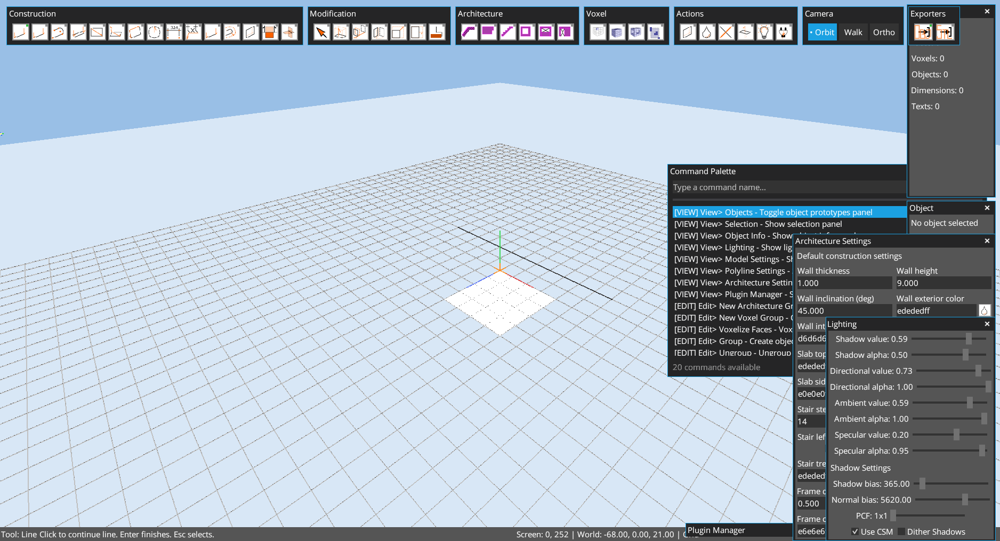

# Chapter 07: Tools Reference

Author: Codex (GPT-5)
Date: February 13, 2026

## Goal
Provide a practical reference for high-use tools and expected interaction patterns.

## Tool Activation
Tools can be activated by:
- toolbar button click,
- command palette,
- MCP command (`tool.builtin.<id>`).

## Construction Tools
- `line`
- `construction_line`
- `polyline`
- `double_line`
- `rectangle`
- `surface_rectangle`
- `quad`
- `circle`
- `linear_dimension`
- `text`
- `face_outline`
- `line_offset`
- `cutout`
- `plane_section`
- `mesh_intersection`

Example (`tool.builtin.line`):

Example (`tool.builtin.rectangle`):

## Modification Tools
- `select`
- `push_pull`
- `move`
- `rotate`
- `scale`
- `stretch`
- `paint`

Example (`tool.builtin.push_pull`) outcome:

## Architecture Tools
- `arch_wall`
- `arch_slab`
- `arch_stair`
- `arch_add_hole`
- `arch_window_frame`
- `arch_door_frame`

Notes:
- Architecture tools auto-create/enter an architecture group when needed.
- Wall/slab/stair/frame dimensions come from `Architecture Settings`.

## Voxel Tools
- `voxel`
- `voxel_volume`
- `voxel_frame`

Example (`tool.builtin.voxel`):

## Object Placement
- Object creation/grouping: `edit.group` (also `Ctrl+G`)
- Ungroup: `edit.ungroup`
- Place object instances with object tools/panel workflows

Example grouped object/prototype state:

## Key Interactions (Tool-Specific)
From `docs/SHORTCUTS.md`:
- `Enter`: commit/finalize/reset draft depending on active tool.
- `Esc`: cancel and return to Select (most tools).
- `Backspace`: remove last segment in polyline-like tools or clear numeric input.
- Numeric typing (`0-9`, `.`, `-`): live numeric input for active tool.
