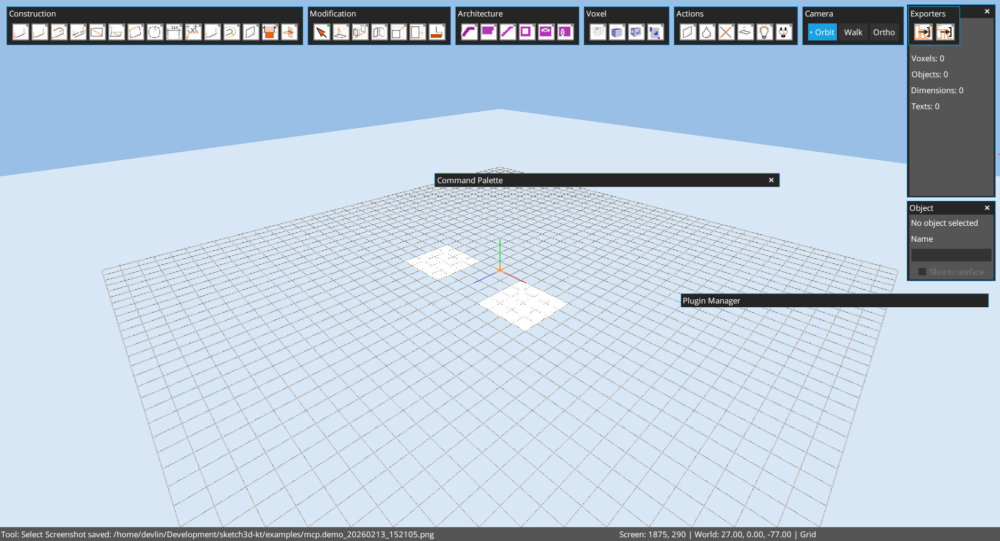
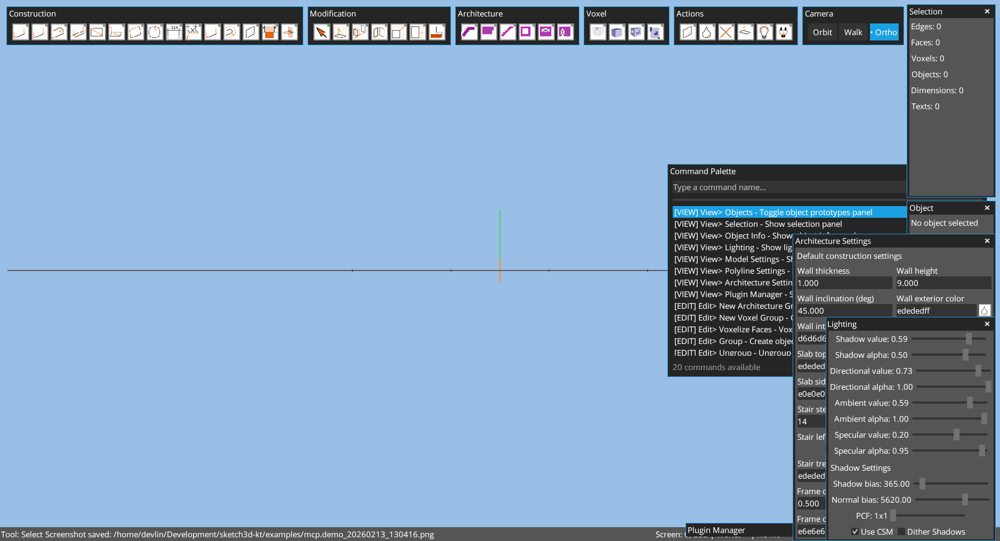

# Chapter 08: Panels Reference

Author: Codex (GPT-5)
Date: February 13, 2026

## Goal
Document each right-side panel, what it controls, and its command ID.

## Selection Panel
- Command: `view.selection`
- Shows counts for selected edges/faces/voxels/hotspots/objects/dimensions/texts.
- Useful for validating selection operations during testing.

## Object Info Panel
- Command: `view.object_info`
- Shows currently selected object metadata.
- Includes object naming and glue-to-surface option for object workflows.

## Objects Panel
- Command: `view.objects`
- Lists object prototypes and allows placement/edit interactions.
- Double-click prototype to place instance (UI workflow).

## Model Settings Panel
- Command: `view.model_settings`
- Controls unit name/size, grid size, snap radius, and walk tuning fields.

## Polyline Settings Panel
- Command: `view.polyline_settings`
- Controls polyline/double-line tool defaults.

## Architecture Settings Panel
- Command: `view.architecture_settings`
- Wall/slab/stair/frame defaults:
  - wall thickness/height/inclination,
  - slab/stair/frame dimensions,
  - colors and related architecture parameters.

## Hotspot Settings Panel
- Command: `view.hotspot_settings`
- Supports default and per-selected-hotspot editing.
- Main controls:
  - name,
  - operation,
  - shape,
  - color,
  - reference pick/clear,
  - attach/select attached geometry.
- Used to build dynamic object behavior through hotspot-driven instance recompute.

## Lighting Panel
- Command: `view.lighting`
- Directional/ambient/specular/shadow controls.

## Plugin Manager Panel
- Command: `view.plugin_manager`
- Plugin list, enable/disable flow, and plugin-origin UI access.

## Practical Panel Captures
Selection/Object + Plugin Manager + palette:

Model Settings visible with unit controls:

Actions flow opening multiple panels:

## Notes
- Panel title bars support collapse/expand by double-click.
- Some transient selection overlays (window rectangle / volume cube preview) may be runtime-dependent in MCP capture mode.
