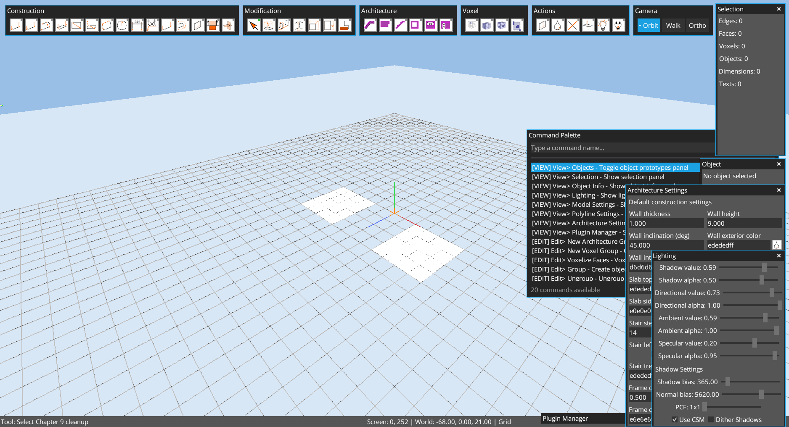
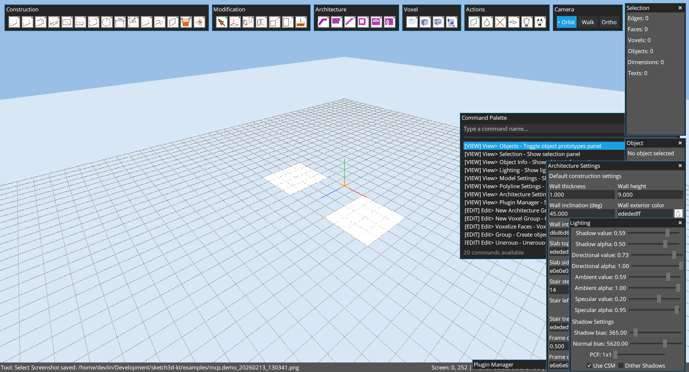
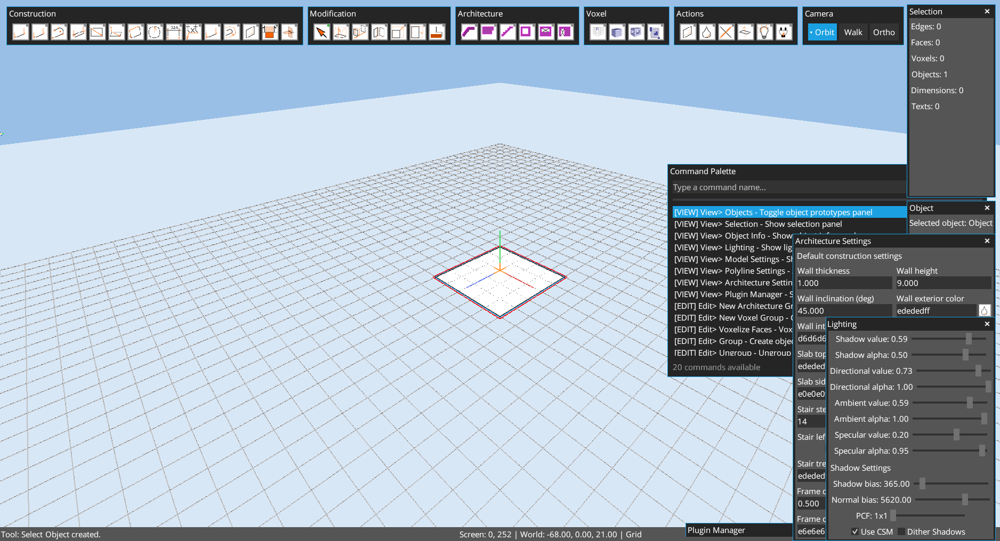

# Chapter 09: Commands Reference

Author: Codex (GPT-5)
Date: February 13, 2026

## Goal
Document command usage patterns and verify command outcomes with practical MCP-driven examples.

## Capture Policy
- Perspective camera is used for final screenshots.
- Camera command examples may invoke orthographic commands internally, then return to perspective before capture.

## Chapter Cleanup
Before this chapter, scene state was reset:

```groovy
app.run {
  while (scene.exitGroup()) {}
  scene.resetScene()
  def rp = scene.rootPrototype()
  rp.lineStore.clearAll()
  rp.faceStore.clearAll()
  rp.dimensionStore.clearAll()
  rp.textStore.clearAll()
  scene.root.children.clear()
  scene.clearAllSelections()
  save.set("examples/mcp.demo.k3d")
  cameraCtl.setPosition(18f, 14f, 18f)
  cameraCtl.setTarget(0f, 0f, 0f)
  camera.up.set(0f, 1f, 0f)
  camera.lookAt(0f, 0f, 0f)
  camera.update()
}
```



## Practical Command Examples

### 2) View commands opening panels
Commands:
- `view.objects`
- `view.selection`
- `view.object_info`
- `view.model_settings`



### 3) Tool command execution
- `tool.builtin.rectangle`
- Draw rectangle from `(-2,0,-2)` to `(3,0,3)`


### 4) Edit command execution
- `tool.builtin.select` then face click near `(0,0,0)`
- `edit.group`



### 5) Camera command execution
- `view.camera.orthographic`
- `view.ortho.front`
- `view.camera.orbit`


## Command Catalog Snapshot
Live snapshot source: `/scene/listCommands` (captured February 13, 2026).

- Total: `61`
- `Tools`: `31`
- `View`: `19`
- `Edit`: `6`
- `Export`: `5`

## High-Use Commands by Category

### Edit
- `edit.group`
- `edit.ungroup`
- `edit.new_architecture_group`
- `edit.new_voxel_group`
- `edit.voxelize_faces`

### Tools
- `tool.builtin.select`
- `tool.builtin.line`
- `tool.builtin.rectangle`
- `tool.builtin.push_pull`
- `tool.builtin.move`
- `tool.builtin.rotate`
- `tool.builtin.scale`
- `tool.builtin.arch_wall`
- `tool.builtin.arch_add_hole`
- `tool.builtin.voxel`

### View
- `view.selection`
- `view.objects`
- `view.object_info`
- `view.model_settings`
- `view.lighting`
- `view.architecture_settings`
- `view.camera.orbit`
- `view.camera.walkthrough`
- `view.camera.orthographic`
- `view.ortho.top|bottom|left|right|front|back`

### Export
- `export.screenshot`
- `export.svg_view`
- `export.ifc_model`
- `exporters.export.obj`
- `exporters.export.stl`

## MCP Endpoints Used
- `GET /scene/listCommands`
- `GET|POST /scene/command`
- `GET|POST /scene/pointer`
- `GET|POST /scene/console`
- `GET /mcp/status`
