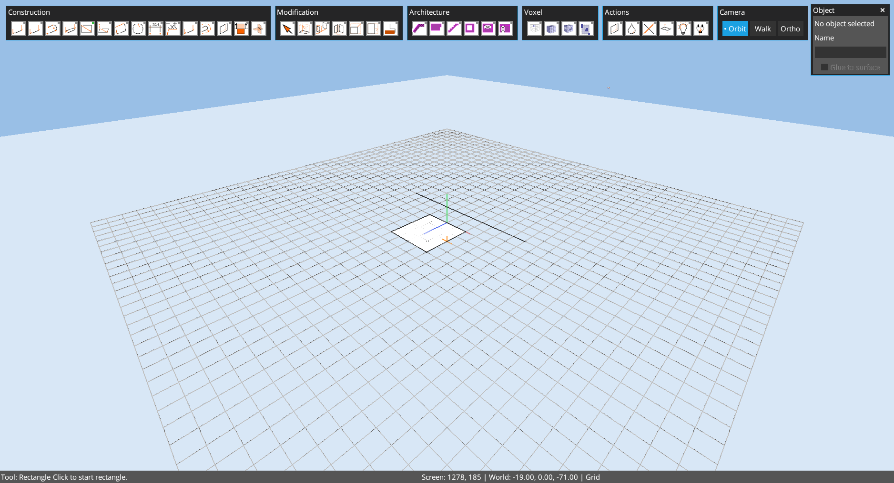
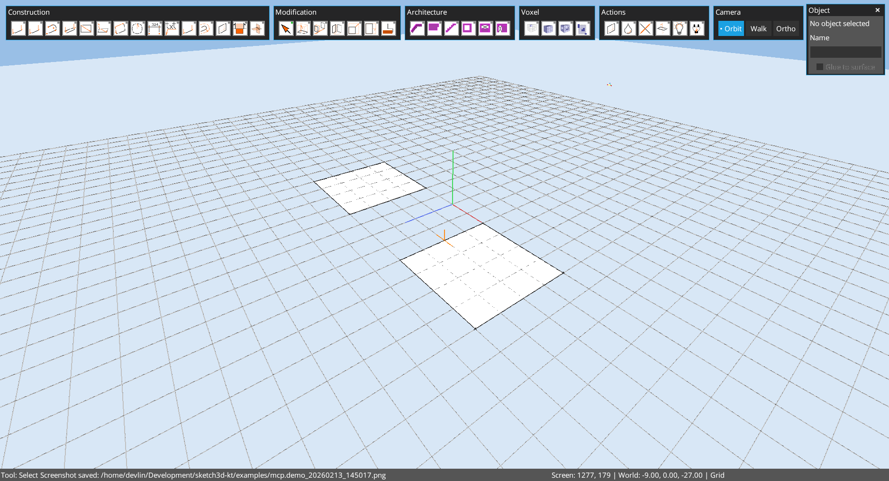

# Chapter 10: Tutorials (Step-by-Step)

Author: Codex (GPT-5)
Date: February 13, 2026

## Goal
Provide reproducible user-level modeling drills that can also be replayed via MCP.

## Tutorial 10.1: Rectangle to Extrusion
Target: create a `4x4` base near origin and extrude upward in Y.

### Steps
1. Activate rectangle tool: `tool.builtin.rectangle`
2. Pick corners near `(-2,0,-2)` and `(2,0,2)` (4x4 base)
3. Activate push/pull: `tool.builtin.push_pull`
4. Click face and extrude to about `Y=12`
5. Orbit camera to inspect final mass

Base rectangle state:

Extruded outcome (perspective, Y-up):

## Tutorial 10.2: Selection and Grouping Drill
1. Draw one or two rectangles.
2. Use `Select` and window/volume selection.
3. Run `edit.group` (or `Ctrl+G`) to create an object prototype.
4. Verify object state in Object panel.

Example grouped-object state:

## Tutorial 10.3: Multi-shape Selection Drill
1. Create two separated rectangles.
2. Test click, shift-add, and drag-selection behavior.
3. Confirm selection feedback in Selection panel.

Example two-shape setup:

## Tutorial 10.4: Voxel Blockout Quick Pass
1. Activate voxel tool: `tool.builtin.voxel`
2. Place several voxels in a row.
3. Switch back to orbit camera and inspect silhouette.

Voxel example:

## MCP Replay Note
For repeatable automation, use:
- `docs/automation/mcp_regression_suite.sh`
- `docs/automation/MCP_REGRESSION_SUITE.md`

These are suitable seeds for user-level regression coverage.
