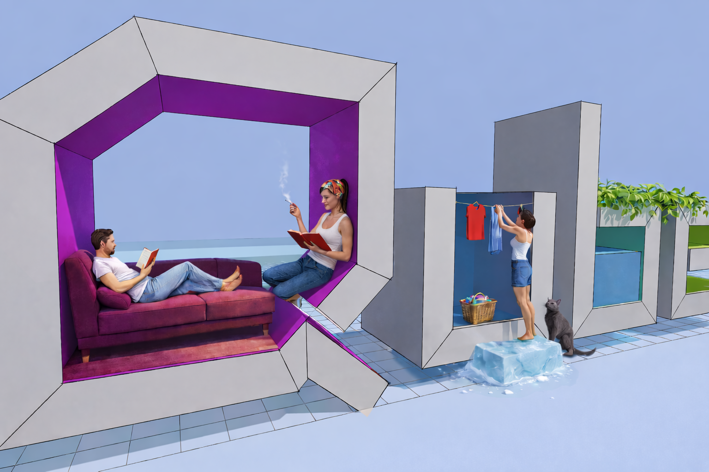

# Octodraw

Octodraw is a Kotlin + libGDX desktop modeler for fast, direct 3D sketching. It focuses on edges, planar faces, tool-driven workflows, and precise snapping with an extensible plugin system.

## Start here

- User Manual: [`USER_MANUAL.md`](USER_MANUAL.md)
- Shortcuts: [`SHORTCUTS.md`](SHORTCUTS.md)
- Plugin Development: [`PLUGIN_DEVELOPMENT.md`](PLUGIN_DEVELOPMENT.md)
- Android store description text (Play/F-Droid): [`specification/ANDROID_STORE_DESCRIPTION.md`](specification/ANDROID_STORE_DESCRIPTION.md)
- Release Notes 3.1.0: [`specification/RELEASE_NOTES-3.1.0.md`](specification/RELEASE_NOTES-3.1.0.md)
- Release Notes 2.9.0: [`specification/RELEASE_NOTES-2.9.0.md`](specification/RELEASE_NOTES-2.9.0.md)
- Privacy Policy: [`PRIVACY_POLICY.md`](PRIVACY_POLICY.md)
- License: [`LICENSE.md`](LICENSE.md)

## Release notes archive

- 3.1.0: [`specification/RELEASE_NOTES-3.1.0.md`](specification/RELEASE_NOTES-3.1.0.md)
- 2.9.0: [`specification/RELEASE_NOTES-2.9.0.md`](specification/RELEASE_NOTES-2.9.0.md)
- 2.7.5: [`specification/RELEASE_NOTES-2.7.5.md`](specification/RELEASE_NOTES-2.7.5.md)
- 1.7.10: [`specification/RELEASE_NOTES-1.7.10.md`](specification/RELEASE_NOTES-1.7.10.md)
- 1.7.9: [`specification/RELEASE_NOTES-1.7.9.md`](specification/RELEASE_NOTES-1.7.9.md)
- 1.7.8: [`specification/RELEASE_NOTES-1.7.8.md`](specification/RELEASE_NOTES-1.7.8.md)
- 1.7.3: [`specification/RELEASE_NOTES-1.7.3.md`](specification/RELEASE_NOTES-1.7.3.md)
- 1.7.1: [`specification/RELEASE_NOTES-1.7.1.md`](specification/RELEASE_NOTES-1.7.1.md)
- 1.4.3: [`specification/RELEASE_NOTES-1.4.3.md`](specification/RELEASE_NOTES-1.4.3.md)

## Highlights

- Draw edges, create faces, and push/pull solids.
- Line workflows include chained `Line` and single-segment `Construction Line`.
- Surface-aligned rectangles, quads, and circles.
- Snap to grid, endpoints, midpoints, lines, faces, and guides.
- Objects (groups) with prototypes, instances, and edit mode.
- Linear dimensions and text entities.
- Scale supports axis-constrained squash/stretch when reference direction is aligned with `X/Y/Z`.
- Real-time lighting and shadow controls.
- Groovy dev console and plugin system.

## Quick workflow

1. Draw a closed loop with Line/Rectangle/Quad/Circle to create a face.
2. Use Push/Pull to extrude.
3. Add guides (`G`/`T`) and snap for precision.
4. Group geometry into Objects (`Ctrl+G`) and place instances.
5. Paint faces, add dimensions, and tune lighting.

## Downloads

Get the latest release artifacts from GitHub Releases:

- Windows: `.zip`, `.msi`, `.msix`
- Linux: `.tar.gz` (preferred), `.zip`
- macOS: `.tar.gz` (preferred), `.zip`

https://github.com/alfu32/k3d/releases

## Specifications

- [`specification/SPEC.md`](specification/SPEC.md)
- [`specification/SPEC.ARCH.md`](specification/SPEC.ARCH.md)
- [`specification/SPEC.grid.md`](specification/SPEC.grid.md)
- [`specification/SPEC.group.md`](specification/SPEC.group.md)
- [`specification/SPEC.lighting.md`](specification/SPEC.lighting.md)
- [`specification/ROADMAP.md`](specification/ROADMAP.md)

## Status

Octodraw is an active work-in-progress. File formats and APIs may change as modeling and topology features evolve.
