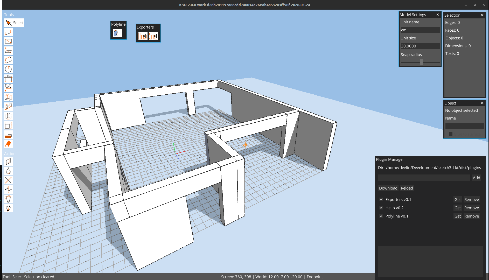
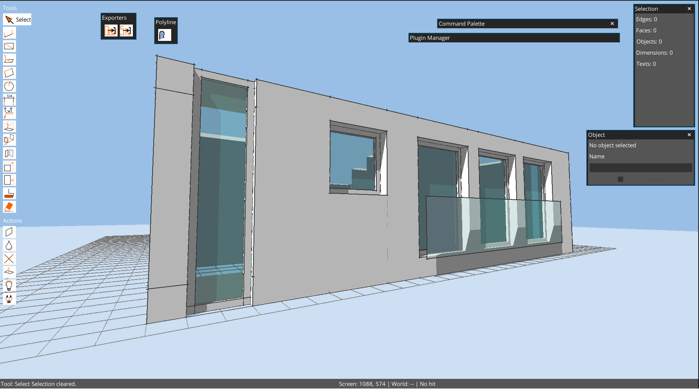

# K3D

[LICENSE.md](LICENSE.md)

[USER_MANUAL.md](USER_MANUAL.md)

[PLUGIN_DEVELOPMENT.md](PLUGIN_DEVELOPMENT.md)

K3D is a Kotlin + libGDX (jvm) desktop application for interactively creating and editing simple 3D geometry. It focuses on direct modeling with edges and planar faces, real-time snapping, and tool-driven workflows.

## What it does today

- Renders a 3D viewport with grid, axes, and guides.
- Supports camera orbit and pan controls.
- Provides core drawing tools for lines, rectangles, and circles.
- Creates faces from closed polylines and from rectangle/circle tools.
- Includes snapping to endpoints, midpoints, grid points/lines, and guides.
- Offers push/pull extrusion on planar faces.
- Provides a cleanup action to split intersections and re-weld edges.

## What it is intended to do

- Expand modeling tools (move/rotate/scale, selection, painting, erasing).
- Build a robust topology layer for edges/faces with adjacency.
- Support face splitting and more reliable boolean-like operations.
- Improve performance through spatial indices for picking and snapping.
- Add project persistence (save/load) and export formats.

## Index
[LICENSE.md](LICENSE.md)

[USER_MANUAL.md](USER_MANUAL.md)

[PLUGIN_DEVELOPMENT.md](PLUGIN_DEVELOPMENT.md)

[specification](specification)

[SPEC.ARCH.md](specification/SPEC.ARCH.md)
[SPEC.md](specification/SPEC.md)
[SPEC.grid.md](specification/SPEC.grid.md)
[SPEC.group.md](specification/SPEC.group.md)
[SPEC.lighting.md](specification/SPEC.lighting.md)

[PRIVACY_POLICY.md](PRIVACY_POLICY.md)

## downloads

Get the latest release artifacts from the releases page:

- Windows: `.zip`, `.msi`, `.msix`
- Linux: `.tar.gz` (preferred), `.zip`
- macOS: `.tar.gz` (preferred), `.zip`

https://github.com/alfu32/k3d/releases
## Status

This is an active work-in-progress. APIs and behavior may change as modeling and topology features evolve.

